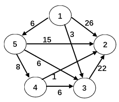

# 单选题
1. 若长度为n的线性表采用顺序结构，在第i个数据元素之前插入一个元素，需要它依次向后移动（）个元素。
**B. n-i+1**
2. 已知A、B和C为3个元素递增有序的顺序表，且同一个表中元素值各不相同，下列算法对A做如下操作：删除那些既在表B又在表C中出现的元素。请将该算法补充完整。
    ```c
    typedef struct {
    ElemType *list;
    int size;
    intMaxSize;
    }SeqList;
    void deletesame(SeqList&A, SeqList B, SeqList C) {
    inti=0, j=0, k=0, m;
    ElemType same;
        while (i<A.size&& j<B.size&& k<C.size) {
                if (C.list[k] <B.list[j])
                    k++;
            else if (C.list[k] >B.list[j])
                    j++;
            else {
                    same=B.list[j];
                    while (i<A.size&&A.list[i]<same)   i++;
                    if (i<A.size&&A.list[i]==same) {
                        m=i+1;
                        while (m<A.size)  {
                        ________________
                        }
                        A.size--;
                    }
            }
        }
    }
    ```
    **B.`A.list[m-1]=A.list[m]; m++;`**
3. 下面哪个不是线性表
    **D. 关联数组**
4. 顺序表是线性表的（ ）存储表示。
    **C. 数组**
5. 顺序表的优点是（ ）。
    **C. 存储密度(存储利用率)高**
6. 在删除表中第i个元素时，同样地，为保持删除后表中原有元素的相对次序不变，需要从前向后依次前移（ ）个元素。
    **A. n-i**
7. 在长度为n的顺序表的表尾插入一个新元素的时间复杂度为（ ）。
    **B. O(1)**
8. 在以下有关顺序表的叙述中正确的是（ ）。
    **B. 集合与顺序表的区别在于集合中的元素不能相等**
9. 对于顺序表，以下说法错误的是（ ）
    **A. 顺序表是用一维数组实现的线性表，数组的下标可以看成是元素的绝对地址**
10. ​需要分配较大空间，插入和删除不需要移动元素的线性表，其存储结构是（）。
    **B.静态链表**
11. (neuDS)在线性表中，若经常要存取第i个数据元素及其前趋，则宜采用( )存储方式。
    **C.顺序表**
12. (neuDS)下面关于串的叙述中，哪一个是不正确的？
    **B.空串是由空格构成的串**
13. (neuDS)设主串的长度为n，模式串的长度为m，则串匹配的KMP算法时间复杂度是( )。
    **C.O(n + m)**
14. 令s="abcabaa"，则它的特征向量next函数值和优化特征向量nextval函数值为(下标从0开始)：2分。
    **C.next={-1,0,0,0,1,2,1},nextval={-1,0,0,-1,0,2,1}**
15. 字符串‘ababaabab’ 的nextval 为：
    **A.(0,1,0,1,04,1,0,1)**
16. （SWPU-DS）串是一种特殊的线性表，其特殊性体现在（ ）。
    **B.数据元素是一个字符**
17. （SWPU-DS）假设以行序为主序存储二维数组 A=array[1..100,1..100]，设每个数据元素占 2 个存储单元，基地址为 10，则 LOC[5,5]=（ ）。
    **B.818**
18. （SWPU-DS）设有数组 A[i,j]，数组的每个元素长度为 3 字节，i 的值为 1 到 8，j 的值为 1 到 10，数组从内存首地址 BA 开始顺序存放，当用以列为主存放时，元素 A[5,8] 的存储首地址为（ ）。
    **B.BA+180**
19. （SWPU-DS）数组 A[0..4, -1..-3, 5..7] 中含有元素的个数（ ）。
    **B.45**
20. （SWPU-DS）广义表 A=(a,b,(c,d),(e,(f,g)))，则 Head( Tail( Head( Tail( Tail(A) ) ) ) ) 的值为（ ）。
    **D.d**
21. （SWPU-DS）广义表 ((a,b,c,d)) 的表头是（ ）。
    **C.(a,b,c,d)**
22. （SWPU-DS）广义表((a,b,c,d))的表尾是（ ）。
    **B.( )**
23. （SWPU-DS）设广义表 L=((a,b,c))，则 L 的长度和深度分别为（ ）。
    **C.1和2**
24. 数组A中，每个元素的长度为3个字节，行下标i从1到8，列下标j从1到10，从首地址SA开始连续存放的存储器内，该数组按列存放，元素A[5][8]的起始地址为( )。
    **B.SA＋180**
25. 已知二维数组A[0..7][0..9]（行下标为0到7，列下标为0到9），数组的每个元素长度为3字节，数据元素A[0][0]的内存首地址为100，当采用列主序存放时，元素A[4][7]的存储首地址为（ ）
    **B.280**
26. 已知二维数组A[0..8][1..10]（行下标为0到8，列下标为1到10），设A的每个元素占用6个字节的存储单元，则存放A至少需要（ ）个字节
    **B.540**
27. 稀疏矩阵A（N行M列，非零元素数为T）采用三元组B表示，那么在三元组中访问A[i][j]所需的时间复杂度是——
    **B.O(T)**
28. 如果二叉树的前序遍历结果是12345，后序遍历结果是32541，那么该二叉树的中序遍历结果是什么？
    **D.无法确定**
29. 若一棵二叉树的前序遍历序列是{ 4, 2, 1, 3, 6, 5, 7 }，中序遍历序列是{ 1, 2, 3, 4, 5, 6, 7 }，则下列哪句是错的？
    **B.4是3的父结点**
30. 若一棵二叉树的后序遍历序列是{ 1, 3, 2, 6, 5, 7, 4 }，中序遍历序列是{ 1, 2, 3, 4, 5, 6, 7 }，则下列哪句是错的？
    **A.这是一棵完全二叉树**
31. 设n,m为一棵二叉树上的两个结点，在中序遍历时，n在m前的条件是（）。
    **C.n在m左方**    
32. 在一非空二叉树的中序遍历中，根结点的右边（）。
    **A.只有右子树上的所有结点**
33. 设x和y是二叉树中的任意两个结点，若在先序遍历中x在y之前，而在后序遍历中x在y之后，则x和y的关系是（）。
    **C.x是y的祖先**
34. (neuDS)对一棵深度为h的二叉树，其结点的个数最多为（ ）。
    **D.2^h-1**
35. (neuDS)一棵非空二叉树的先根遍历与中根遍历正好相同，则该二叉树满足（ ）。
    **A.所有结点无左孩子**
36. (neuDS)若某棵二叉树的先根遍历序列为ABCDEF，中根遍历序列为CBDAEF，则这棵二叉树的后根遍历序列为（ ）。
    **B.CDBFEA**
37. 一棵有 1001 个结点的完全二叉树，其叶子结点数为_____ 。
    **D.501**
38. 一棵度为 4 的树中有 20 个度为 4 的结点、10 个度为 3 的结点、1 个度为 2 的结点和 10 个度为1 的结点，则树的叶子结点数为 _____ 。
    **B.82**
39. 一棵二叉树的先序序列： abdfcegh，中序序列：bfdagehc。后序遍历序列为（ ）。
    **C.fdbgheca**
40. 要使一棵非空二叉树的先序序列与中序序列相同，其所有非叶结点须满足的条件是（）。
    **B.只有右子树**
41. 某二叉树的中序序列和后序序列正好相反，则该二叉树一定是____。
    **C.任一结点无左孩子**
42. 对于如下代码段，说法不正确的是：
    ```python
    class TreeNode:
    def __init__(self, value):
        self.leftChild = None
        self.rightChild = None
        self.value = value

    def tree_test_function(T):
        L = [T]
        while len(L) > 0:
            p = L[-1]
            del L[-1]
            print(p.value)
            if p.leftChild != None:
                L.append(p.leftChild)
            if p.rightChild != None:
                L.append(p.rightChild)
    ```
    **B.`tree_test_function` 函数的功能是输出一棵二叉树的先序遍历序列**
43. 假定只有四个结点A、B、C、D的二叉树，其前序遍历序列为ABCD，则下面哪个序列是不可能的中序遍历序列？
    **D.DABC**
44. 对于二叉树，如果其中序遍历结果与前序遍历结果一样，那么可以断定该二叉树：
    **B.所有结点都没有左儿子**
45. 具有10个叶子结点的二叉树中有（　）个度为2的结点。
    **B.9**
46. 设 T 是非空二叉树，若 T 的先序遍历和中序遍历序列相同，则 T 的形态是__
    **D.所有结点只有右孩子**
47. 若一棵完全二叉树有2001个结点，则该二叉树叶结点的个数是( )。
    **C.1001**
48. 二叉树T，已知其前序遍历序列为1 2 4 3 5 7 6，中序遍历序列为4 2 1 5 7 3 6，则其后序遍历序列为（ ）。
    **B.4 2 7 5 6 3 1**
49. 对一棵二叉树的结点从 1 开始顺序编号。要求每个结点的编号都大于其子树所有结点的编号，且左子树所有结点的编号都小于右子树所有结点的编号。可采用 ____ 实现编号。
    **B.后序遍历**
50. 对一棵二叉树的结点从 1 开始顺序编号。要求每个结点的编号都小于其子树所有结点的编号，且左子树所有结点的编号都小于右子树所有结点的编号。可采用 ▁▁▁▁▁ 实现编号。
    **A.先序遍历**
51. 已知一棵二叉树的树形如下图所示，若其后序遍历序列为 f, d, b, e, c, a，则其先（前）序遍历序列是：
    **A.a, e, d, f, b, c**
52. 一棵非空二叉树，若后序遍历与中序遍历的序列相反，则该二叉树 ▁▁▁▁▁ 。
    ```mermaid
    graph TD
    A(( )) --- B(( )) & C(( ))
    B --- D(( )) & E(( ))
    E --- F(( ))
    E --- G(( ))
    style F fill:#f100,stroke-width:0px
    linkStyle 4 stroke:#0ff,stroke-width:0px
    ```
    **A.所有结点均无左孩子**
53. 若要检查有向图中有无回路，除了可以利用拓扑排序算法外，下列哪种算法也可以用？
    **D.深度优先搜索**
54. 下列算法的功能是（）。
    ```c
    typedef  struct Node {
        int  adjvex;                                //邻接点的位置
        struct Node  *next;                         //指向下一条边（弧）
    } edgenode;                                        //边结点
    typedef   edgenode  *adjlist[ MaxVertexNum ];
    void Graph2(adjlist G, int n, int vex)
    { //G是n个顶点的邻接表存储结构的无向图，vex是某顶点号
    int i ;
    edgenode  *p,*q;
    while (G[vex] != NULL) {
            p= G[vex];
            G[vex]= G[vex]->next;
            delete p;
    }
    for( i = 0 ; i< n; i++){
        if (i == vex || G[i]==NULL) continue;
        p = G[i];
        if (p->adjvex == vex){
            G[i] = G[i]->next ;
            delete p;
        }
        else {
            q = p->next;
    while(q ){
                    if (q ->adjvex == vex){
                        p->next = q ->next ;  delete q;
                        q = p ->next ;
                        break;
                    }
                    p=q;
                    q = q->next ;
            }   //while
    }    //else
    }   //for
                }
    ```
    **C.在图G中删除顶点v 相关联的边**
55. 下面结构中最适于表示稀疏无向图的是（ ） 。
    **C.邻接多重表**
56. 具有n（n>1）个顶点的连通图，其边数e最少为（ ）。
    **D.n-1**
57. 下面是某无向图G的邻接矩阵。该无向图的边数为（ ）。
    $$\begin{matrix}
    0 & 1 & 0 & 1 \\
    1 & 0 & 1 & 1 \\
    0 & 1 & 0 & 0 \\
    1 & 1 & 0 & 0 
    \end{matrix}$$
    **A.4**
58. 具有n（n>1）个顶点的强连通图，其弧数e至少为（ ）。
    **B.n**
59. 具有n（n>1）个顶点的强连通图，其弧数e必满足（ ）。
    **D.n≤e≤n(n-1)**
60. 具有44个顶点的无向图至少有多少条边才能形成连通图 ( ).
    **A.43**
61. 具有37个顶点的无向图至少有多少条边才能形成连通图 ( ).
    **A.36**
62. 具有28个顶点,210条边的有向图，所有顶点度的和为( ).
    **A.420**
63. 若要求在找到从`S`到其他顶点最短路的同时，还给出不同的最短路的条数，我们可以将Dijkstra算法略作修改，增加一个`count[]`数组：`count[V]`记录`S`到顶点`V`的最短路径有多少条。则`count[V]`应该被初始化为：
    **D.`count[S]=1;` 对于其他顶点`V`则令`count[V]=0`**
64. 用相邻矩阵A表示图，判定任意两个顶点Vi和Vj之间是否有长度为m 的路径相连，则只要检查（ ）的第i行第j列的元素是否为零即可。
    **C. Am**
65. (1). 求从指定源点到其余各顶点的迪杰斯特拉（Dijkstra）最短路径算法中弧上权不能为负的原因是在实际应用中无意义；
    (2). 利用Dijkstra求每一对不同顶点之间的最短路径的算法时间是O(n3 ) ；（图用邻接矩阵表示）
    (3). Floyd求每对不同顶点对的算法中允许弧上的权为负，但不能有权和为负的回路。
    上面不正确的是（ ）。
    **A.(1),(2),(3)**
66. 使用 Dijkstra 算法求下图中从顶点 1 到其余各顶点的最短路径，将当前找到的从顶点 1 到顶点 2、3、4、5 的最短路径长度保存在数组 dist 中，求出第二条最短路径后，dist 中的内容更新为：
    
    **C.21、3、14、6**
