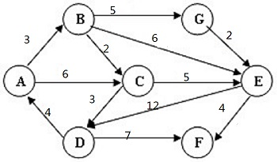

# 填空题
1. 栈的运算遵循 **后进先出** 的原则。
2. 设栈S和队列Q的初始状态均为空，元素{1, 2, 3, 4, 5, 6, 7}依次进入栈S。若每个元素出栈后立即进入队列Q，且7个元素出队的顺序是{2, 6, 5, 4, 7, 3, 1}，则栈S的容量至少是：**5**
3. 以下运算实现在链栈上的初始化，请在空白处用请适当句子予以填充。
    ```c
    void InitStacl(LstackTp *ls){ls=NULL;}
    ```
    **答案** **`ls=NULL`**
4. 以下运算实现在链栈上的进栈，请在空白处用请适当句子予以填充。
    ```c
    void Push（LStackTp *ls,DataType x）{
     LstackTp *p;p=malloc(sizeof(LstackTp));
     p->data=x;
     p->next=ls;
     ls=p
    }
    ```
    **答案**   
    **填空1 `p->data=x`
    填空2 `ls=p`**
5. 以下运算实现在链栈上的退栈，请在空白处用请适当句子予以填充。
    ```c
    int pop(LstackTp *ls,DataType *x){
    LstackTp *p;
    if(ls!=NULL){
        p=ls;
        *x=p->data;
        ls=ls->next;
        free(p);
        return(1);
     }else 
            return(0);
    }
    ```
    **答案**
    **填空1 `p->data`
    填空2 `free(p)`**
6. 设栈S和队列Q的初始状态均为空，元素{1, 2, 3, 4, 5, 6, 7}依次进入栈S。若每个元素出栈后立即进入队列Q，且7个元素出队的顺序是{2, 6, 5, 4, 7, 3, 1}，则栈S的容量至少是： **5** 个元素空间。
7. 下面函数Push_SeqStack (SeqStack *s, datatype x)实现了在顺序栈的入栈算法。请填空。 顺序栈类型说明：
    ```c
    #define MAXSIZE  1024   
    typedef  struct
    {    
        datatype  data[MAXSIZE];
        int  top;
    }SeqStack;
    int Push_SeqStack (SeqStack *s, datatype  x)
    {    
        if (s->top==MAXSIZE-1)  
            return 0;
        else {      
                s->top++;              
                s->data[s->top]=x;                    
                return 1;
             }
    }
    ```
    **答案**
    **填空1 `s->top++`
    填空2 `s->data[s->top]=x`**
8. 设目标串text=“abccdcdccbaa”，模式串pattern=“cdcc”，若采用BF（Brute Force）算法，则在第 **6** 趟匹配成功。
9. 若n为主串长度，m为模式串长度，采用BF（Brute Force）模式匹配算法，在最好情况下需要的字符比较次数为 **m** 。
10. 若n为主串长度，m为模式串长度，采用BF（Brute Force）模式匹配算法，在最坏情况下需要的字符比较次数为 **m\*(n-m+1)** 。
11. 设二维数组a[10][20]，每个数组元素占用1个存储单元，若按列优先顺序存放数组元素，a[0][0]的存储地址为200，则a[6][2]的存储地址是多少？ **226**
12. 字符串`I LOVE GUANGZHOU!`的长度是 **17** (请以阿拉伯数字填写，前后不要有空格)
13. 数组A中，每个元素的长度为3个字节，行下标i从1到8，列下标j从1到10，从首地址SA开始连续存放的存储器内，该数组按行存放，元素A[8][5]的起始地址为 **222+SA** 。
14. 完成表格
    |j|	模式|next[j]|nextval[j]|
    |:---:|:---:|:---:|:---:|
    |0|	a|-1|-1|
    |1|	b|0|0|
    |2|	a|0|-1|
    |3|	b|1|0|
    |4|	a|2|-1|
    |5|	a|3|3|
    |6|	a|1|1|
    |7|	b|1|0|
    |8|	a|2|-1|
    |9|	b|3|0|

15. 已知二叉排序树的左右子树均不为空，则 **左子树** 上所有结点的值均小于它的根结点值， **右子树** 上所有结点的值均大于它的根结点的值。
16. 一棵二叉树的前序遍历序列是`ABDFECGHK`，中序遍历序列是`DBEFAGHCK`，则它的后序遍历序列是 **DEFBHGKCA**  (填写半角大写字母且不要添加空格，格式如`ABCDEFG`)
17. 一棵二叉树的后序遍历序列是`DEFBHGKCA`，中序遍历序列是`DBEFAGHCK`，则它的前序遍历序列是 **ABDFECGHK** (填写半角大写字母且不要添加空格，格式如`ABCDEFG`)
18. 具有n个结点的二叉树中,一共有 **2n** 个指针域,其中只有 **n-1** 个用来指向结点的左右孩子，其余的 **n+1** 个指针域为NULL。
19. 若一个二叉树的叶子结点是某子树的中序遍历序列中的最后一个结点，则它必是该子树的 **先序** 遍历序列中的最后一个结点。
20. 已知二叉树的先序遍历序列为`EIFCGABHDJ`，中序遍历序列为`FIGCAEHDBJ`，则后序遍历序列为 **FGACIDHJBE**
21. 已知二叉树的扩充先序序列是“AB@@CD@EF@G@@@@",则此树的中序序列是 **BADFGEC** 。(@表示空结点，请以大写字母填空，不要有空格，空结点也不填写)
22. 一棵二叉树的后序遍历序列为DABEC，中序遍历序列为DEBAC，则先序遍历序列为 **CEDBA** 。（请用大写字母填空，不要有空格）
23. 已知一棵正则二叉树的先序序列是ABCDEFG，后序序列是CEFDBGA，则此树中B的右儿子是 **D** 。
24. 已知二叉树后先序遍历的序列为`DBECA`，中序遍历的序列为`EBDAC`则先序遍历的序列为 **AEBDC**
25. 图的深度优先搜索（DFS）使用了一种数据结构，这种数据结构是 **栈** 。
26. 本题要求给出下列无权图中从B到其他顶点的最短路径。注意：填空时不能有任何空格。
    | 终点| 路径|
    |B->A | **BCDA** |
    **答案一** 最多可设十个可选答案，用 "|" 隔开。
    每题可以有多个空。**答案二**。题目创建后不可修改填空数量。
27. 本题要求给出下列有向有权图中从A到其他顶点的最短路径。注意：填空时不能有任何空格，字母必须为大写。
    
    | 终点 | 路径 |
    |:---:|:---:|
    | A->B | AB |
    | A->C | **ABC** |
    | A->D | **ABCD** |
    | A->E | ABGE |
    | A->F | **ABEF** |
    | A->G | ABG |