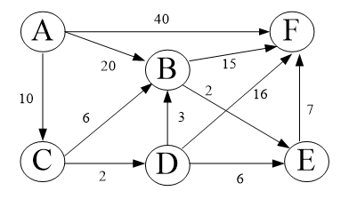

# 多选题
1. 非空线性表的结构特征
    非空线性表具有哪些结构特征？
    **A. 只有唯一的开始结点和唯一的终端结点
    C. 除开始结点外，每个结点只有一个前驱结点
    D. 除终端结点外，每个结点只有一个后继结点**
2. 链表 - 时间复杂度
    在包含$n$个数据元素的链表中，▁▁▁▁▁ 的时间复杂度为$O(n)$。
    **A. 访问第$i$个数据元素
    B. 在第$i (1\leq i\leq n)$个结点后插入一个新结点
    C. 删除第$i (1\leq i \leq n)$个结点**
3. 树的主要遍历方法有（ ）。
    **A.前序遍历
    B.后序遍历
    C.中序遍历
    D.层序遍历**
4. 关于二叉树，下列说法正确的是
    **A.每个结点至多有两个子树。
    C.树的结点包含一个数据元素和指向其子树的分支。**
5. 在某次救灾中，已知6个救援点A、B、C、D、E、F及救援点之间运送物资的时长如下图所示，为了尽快将救援点A的救援物资运送到其余救援点，需要运用用迪杰斯特拉（Dijkstra）算法求出从救援点A到其余救援点的最短运送时长，则以下说法正确的是（）
    
    **A.依次求得的是救援点A分别到救援点C、D、B、E、F的最短运送时长
    B.若求得A-->C的最短运送时长，则可更新A-->C-->B的最短运送时长为16
    C.若求得A-->C-->D的最短运送时长，则可更新A-->C-->D-->F的最短运送时长为28
    D.若求得A-->C-->D的最短运送时长，则可更新A-->C-->D-->E的最短运送时长为18
    E.最终，救援点A到救援点E的最短运送时长路线为A-->C-->D-->B-->E**