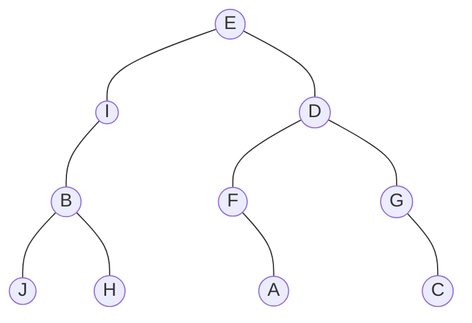
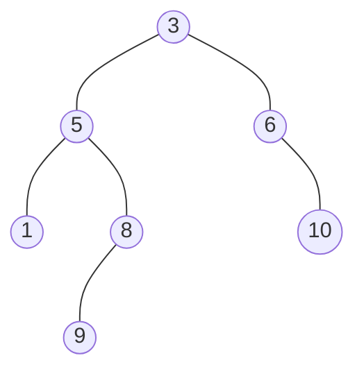
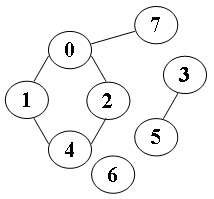
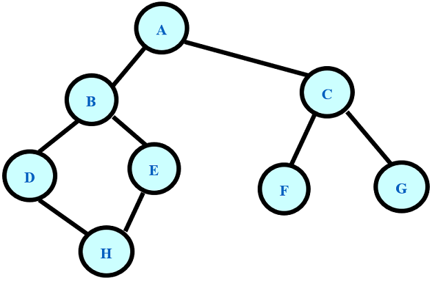

# 编程题
### 1. 一元多项式求导  
设计函数求一元多项式的导数。
##### 输入格式:
以指数递降方式输入多项式非零项系数和指数（绝对值均为不超过1000的整数）。数字间以空格分隔。
##### 输出格式:
以与输入相同的格式输出导数多项式非零项的系数和指数。数字间以空格分隔，但结尾不能有多余空格。
##### 输入样例:
`3 4 -5 2 6 1 -2 0`
##### 输出样例:
`12 3 -10 1 6 0`
##### C代码示例:
```c
#include<stdio.h>
#include<malloc.h>
#include <stdlib.h>
#include<math.h>

int main()
{
    int exp;//指数
    int coef;//系数
    int tag=0;//用于格式控制
    while(scanf("%d%d",&coef,&exp)!=EOF)
    {
        if(exp)
        {
            coef=coef*exp;
            exp=exp-1;
            if(tag)//第一次不需要空格
                printf(" ");
            
            printf("%d %d",coef,exp);
            tag++;
        }
    }
    if(tag==0)//只要有输出，tag就不为0
    {
        printf("0 0");//一个都没输出的情况，即零多项式
    }
    return 0;
}
```
### 2. 一元多项式的乘法与加法运算  
设计函数分别求两个一元多项式的乘积与和。
##### 输入格式:
输入分2行，每行分别先给出多项式非零项的个数，再以指数递降方式输入一个多项式非零项系数和指数（绝对值均为不超过1000的整数）。数字间以空格分隔。
##### 输出格式:
输出分2行，分别以指数递降方式输出乘积多项式以及和多项式非零项的系数和指数。数字间以空格分隔，但结尾不能有多余空格。零多项式应输出0 0。
##### 输入样例:
`4 3 4 -5 2  6 1  -2 0`
`3 5 20  -7 4  3 1`
##### 输出样例:
`15 24 -25 22 30 21 -10 20 -21 8 35 6 -33 5 14 4 -15 3 18 2 -6 1`
`5 20 -4 4 -5 2 9 1 -2 0`
##### C代码示例:
```c
#include <stdio.h>
#include <stdlib.h>

#define MAXN 1001

typedef struct {
    int coef;
    int expn;
} PolyNode;

PolyNode poly1[MAXN], poly2[MAXN], poly3[MAXN], poly4[MAXN];

int read_poly(PolyNode poly[]) {
    int n;
    scanf("%d", &n);
    for (int i = 0; i < n; ++i) {
        scanf("%d %d", &poly[i].coef, &poly[i].expn);
    }
    return n;
}

int cmp(const void *a, const void *b) {
    return ((PolyNode *)b)->expn - ((PolyNode *)a)->expn;
}

void print_poly(PolyNode poly[], int n) {
    if (n == 0) {
        printf("0 0\n");
        return;
    }
    printf("%d %d", poly[0].coef, poly[0].expn);
    for (int i = 1; i < n; ++i) {
        printf(" %d %d", poly[i].coef, poly[i].expn);
    }
    printf("\n");
}

void add_poly(PolyNode poly1[], int n1, PolyNode poly2[], int n2, PolyNode poly3[], int *n3) {
    int i = 0, j = 0, k = 0;
    while (i < n1 && j < n2) {
        if (poly1[i].expn > poly2[j].expn) {
            poly3[k++] = poly1[i++];
        } else if (poly1[i].expn < poly2[j].expn) {
            poly3[k++] = poly2[j++];
        } else {
            int sum = poly1[i].coef + poly2[j].coef;
            if (sum != 0) {
                poly3[k].coef = sum;
                poly3[k++].expn = poly1[i].expn;
            }
            ++i;
            ++j;
        }
    }
    while (i < n1) {
        poly3[k++] = poly1[i++];
    }
    while (j < n2) {
        poly3[k++] = poly2[j++];
    }
    *n3 = k;
}

void mul_poly(PolyNode poly1[], int n1, PolyNode poly2[], int n2, PolyNode poly4[], int *n4) {
    if (n1 == 0 || n2 == 0) {
        *n4 = 0;
        return;
    }
    qsort(poly1, n1, sizeof(PolyNode), cmp);
    qsort(poly2, n2, sizeof(PolyNode), cmp);
    for (int i = 0; i < n1; ++i) {
        for (int j = 0; j < n2; ++j) {
            int coef = poly1[i].coef * poly2[j].coef;
            int expn = poly1[i].expn + poly2[j].expn;
            poly4[i * n2 + j].coef = coef;
            poly4[i * n2 + j].expn = expn;
        }
    }
    *n4 = n1 * n2;
    qsort(poly4, *n4, sizeof(PolyNode), cmp);
    for (int i = 0; i < *n4 - 1; ++i) {
        if (poly4[i].expn == poly4[i + 1].expn) {
            poly4[i + 1].coef += poly4[i].coef;
            poly4[i].coef = 0;
        }
    }
    int k = 0;
    for (int i = 0; i < *n4; ++i) {
        if (poly4[i].coef != 0) {
            poly4[k++] = poly4[i];
        }
    }
    *n4 = k;
}

int main() {
    int n1 = read_poly(poly1);
    int n2 = read_poly(poly2);
    int n3, n4;
    add_poly(poly1, n1, poly2, n2, poly3, &n3);
    mul_poly(poly1, n1, poly2, n2, poly4, &n4);
    print_poly(poly4, n4);
    print_poly(poly3, n3);
    return 0;
}
```
### 3. 图书管理
图书管理是一件十分繁杂的工作，在一个图书馆中每天都会有许多新书加入。为了更方便的管理图书（以便于帮助想要借书的客人快速查找他们是否有他们所需要的书），我们需要设计一个图书查找系统。
该系统需要支持 2 种操作：
`add(s)`表示新加入一本书名为s的图书。

`find(s)`表示查询是否存在一本书名为s的图书。

##### 输入格式:
第一行包括一个正整数 n (n<=30000)，表示操作数。 以下n行，每行给出 2 种操作中的某一个指令条，指令格式为：
```shell
add s
find s
```
在书名 s 与指令（add，find）之间有一个隔开，我们保证所有书名的长度都不超过200 。可以假设读入数据是准确无误的。
##### 输出格式:
对于每个 find(s) 指令，我们必须对应的输出一行 yes 或 no，表示当前所查询的书是否存在于图书馆内。
*注意：一开始时图书馆内是没有一本图书的。并且，对于相同字母不同大小写的书名，我们认为它们是不同的。*
##### 输入样例:
```shell
4
add Inside C#
find Effective Java
add Effective Java
find Effective Java
```
##### 输出样例:
```shell
no
yes
```
##### C代码示例:
```c
#include <stdio.h>
#include <stdlib.h>
#include <string.h>

#define MAXN 30010
#define MAXM 210

typedef struct {
    char name[MAXM];
    int next;
} Book;

Book books[MAXN];
int head[MAXN];
int book_cnt;

int hash(char *str) {
    int hash = 0;
    for (int i = 0; str[i]; ++i) {
        hash = (hash * 27 + str[i] - 'A' + 1) % MAXN;
    }
    return hash;
}

void add_book(char *name) {
    int h = hash(name);
    strcpy(books[book_cnt].name, name);
    books[book_cnt].next = head[h];
    head[h] = book_cnt++;
}

int find_book(char *name) {
    int h = hash(name);
    for (int i = head[h]; i != -1; i = books[i].next) {
        if (strcmp(books[i].name, name) == 0) {
            return 1;
        }
    }
    return 0;
}

int main() {
    int n;
    scanf("%d", &n);
    memset(head, -1, sizeof(head));
    while (n--) {
        char op[10], name[MAXM];
        scanf("%s %s", op, name);
        if (strcmp(op, "add") == 0) {
            add_book(name);
        } else {
            if (find_book(name)) {
                printf("yes\n");
            } else {
                printf("no\n");
            }
        }
    }
    return 0;
}
```
### 4. 栈的实现及基本操作
给定一个初始为空的栈和一系列压栈、弹栈操作，请编写程序输出每次弹栈的元素。栈的元素值均为整数。
##### 输入格式:
输入第1行为1个正整数n，表示操作个数；接下来n行，每行表示一个操作，格式为1 d或0。1 d表示将整数d压栈，0表示弹栈。n不超过20000。
##### 输出格式:
按顺序输出每次弹栈的元素，每个元素一行。若某弹栈操作不合法（如在栈空时弹栈），则对该操作输出invalid。
##### 输入样例:
```shell
7
1 1
1 2
0
0
0
1 3
0
```
##### 输出样例:
```shell
2
1
invalid
3
```
##### C++代码示例:
```c++
#include <iostream>
using namespace std;

const int N = 100010;

int stk[N], tt;

int main()
{
    int n;
    cin >> n;

    while (n -- )
    {
        int op;
        cin >> op;
        if (op == 1)
        {
            int x;
            cin >> x;
            stk[ ++ tt] = x;
        }
        else
        {
            if (tt == 0) puts("invalid");
            else
            {
                cout << stk[tt] << endl;
                tt -- ;
            }
        }
    }

    return 0;
}
```
### 5. 栈的基本操作
给定一个初始为空的栈和一系列进栈、出栈操作，请编写程序输出经过这些操作后栈的元素。栈的元素值均为整数。
##### 输入格式:
输入第1行为1个正整数n，表示操作个数；
第2行为给出的n个整数，非0元素表示进栈，此非0元素即为进栈元素，0元素表示出栈。
保证栈中元素个数不超过10个。
##### 输出格式:
第一行按出栈顺序输出所有出栈元素，以一个空格隔开；如果栈满时做进栈操作会输出"FULL”，如果栈空时做出栈操作会输出"EMPTY"；
第二行中输出栈中所有元素，以一个空格隔开。
末尾均有一个空格。
##### 输入样例:
```shell
12
3 1 2 0 0 -1 0 0 0 4 5 0
```
##### 输出样例:
```shell
2 1 -1 3 EMPTY 5 
4 
```
##### C++代码示例:
```c++
#include <iostream>
using namespace std;

const int N = 10;

int stk[N], tt = -1;

int main()
{
    int n;
    cin >> n;

    while (n -- )
    {
        int x;
        cin >> x;

        if (x == 0)
        {
            if (tt == -1) cout << "EMPTY ";
            else cout << stk[tt -- ] << ' ';
        }
        else
        {
            if (tt == N - 1) cout << "FULL ";
            else stk[ ++ tt] = x;
        }
    }

    cout << endl;

    for (int i = 0; i <= tt; i ++ ) cout << stk[i] << ' ';

    return 0;
}
```
### 6. N 皇后问题(queen)
在$N\times N$的棋盘上放置$N$个皇后（$N\leq 10$）而彼此不受攻击（即在棋盘的任一行，任一列和任一对角线上不能放置 2 个皇后），编程求解所有的摆放方法。
###### 输入格式:
一个整数 n。
###### 输出格式:
每行输出一种方案，每种方案顺序输出皇后所在的列号，各个数之间有空格隔开。若无方案，则输出 `no solute!`
###### 输入样例:
在这里给出一组输入。例如：
```shell
4
```
##### 输出样例:
在这里给出相应的输出。例如：
```shell
2 4 1 3 
3 1 4 2 
```
##### C代码示例:
```c
#include <stdio.h>
#include <stdlib.h>

#define MAXSIZE 10 // 棋盘大小和皇后个数的最大值

int n; // 棋盘大小和皇后个数
int board[MAXSIZE]; // 棋盘，board[i]表示第i行皇后所在的列
int res[MAXSIZE][MAXSIZE]; // 存储所有可行解
int count; // 可行解的个数

// 判断当前位置是否可以放置皇后
int isValid(int row, int col) {
    for (int i = 0; i < row; i++) {
        if (board[i] == col || abs(i - row) == abs(board[i] - col)) {
            return 0;
        }
    }
    return 1;
}

// 回溯函数
void backtrack(int row) {
    if (row == n) { // 找到一种可行解
        for (int i = 0; i < n; i++) {
            res[count][i] = board[i];
        }
        count++;
        return;
    }
    for (int col = 0; col < n; col++) {
        if (isValid(row, col)) {
            board[row] = col; // 放置皇后
            backtrack(row + 1); // 递归到下一行
            board[row] = -1; // 恢复状态
        }
    }
}

int main() {
    scanf("%d", &n);

    for (int i = 0; i < n; i++) {
        board[i] = -1;
    }
    count = 0;
    backtrack(0);

    if (count == 0) {
        printf("no solute!\n");
    } else {
        for (int i = 0; i < count; i++) {
            for (int j = 0; j < n; j++) {
                printf("%d ", res[i][j]+1);
            }
            printf("\n");
        }
    }

    return 0;
}
```
### 7. 堆宝塔
堆宝塔游戏是让小朋友根据抓到的彩虹圈的直径大小，按照从大到小的顺序堆起宝塔。但彩虹圈不一定是按照直径的大小顺序抓到的。聪明宝宝采取的策略如下：
首先准备两根柱子，一根 A 柱串宝塔，一根 B 柱用于临时叠放。
把第 1 块彩虹圈作为第 1 座宝塔的基座，在 A 柱放好。
将抓到的下一块彩虹圈 C 跟当前 A 柱宝塔最上面的彩虹圈比一下，如果比最上面的小，就直接放上去；否则把 C 跟 B 柱最上面的彩虹圈比一下：
如果 B 柱是空的、或者 C 大，就在 B 柱上放好；
否则把 A 柱上串好的宝塔取下来作为一件成品；然后把 B 柱上所有比 C 大的彩虹圈逐一取下放到 A 柱上，最后把 C 也放到 A 柱上。
重复此步骤，直到所有的彩虹圈都被抓完。最后 A 柱上剩下的宝塔作为一件成品，B 柱上剩下的彩虹圈被逐一取下，堆成另一座宝塔。问：宝宝一共堆出了几个宝塔？最高的宝塔有多少层？
##### 输入格式：
输入第一行给出一个正整数$N（\leq 10^3$ ），为彩虹圈的个数。第二行按照宝宝抓取的顺序给出 N 个不超过 100 的正整数，对应每个彩虹圈的直径。
##### 输出格式：
在一行中输出宝宝堆出的宝塔个数，和最高的宝塔的层数。数字间以 1 个空格分隔，行首尾不得有多余空格。
##### 输入样例：
```shell
11
10 8 9 5 12 11 4 3 1 9 15
```
##### 输出样例：
```shell
4 5
```
##### 样例解释：
宝宝堆成的宝塔顺次为：
- 10、8、5
- 12、11、4、3、1
- 9
- 15、9
##### C++代码示例：
```c++
#include<bits/stdc++.h>
using namespace std;
int max(int a,int b)
{
	return a>b?a:b;
}
int main()
{
	int n;
	cin>>n;
	stack<int>A,B;
	int count=0;
	int max1=0;
	while(n--)
	{
		int C;
		cin>>C;
		if(A.empty()||C<A.top())
			A.push(C);
		else
		{
			if(B.empty()||C>B.top())
				B.push(C);
			else
			{
				max1=max(max1,A.size());
				while(A.size())
					A.pop();
				count++;
				while(!B.empty()&&B.top()>C)
				{
					A.push(B.top());
					B.pop();
				}
				A.push(C);
			}
		}
	}
	if(!A.empty())
	{
		max1=max(max1,A.size());
		count++;
		while(!A.empty())
		{
			A.pop();
		}
	}
	if(!B.empty())
	{
		max1=max(max1,B.size());
		count++;
		while(!B.empty())
		{
			B.pop();
		}
	}
	cout<<count<<" "<<max1;
}
```
### 8. 银行排队问题之单窗口“夹塞”版
排队“夹塞”是引起大家强烈不满的行为，但是这种现象时常存在。在银行的单窗口排队问题中，假设银行只有1个窗口提供服务，所有顾客按到达时间排成一条长龙。当窗口空闲时，下一位顾客即去该窗口处理事务。此时如果已知第i位顾客与排在后面的第j位顾客是好朋友，并且愿意替朋友办理事务的话，那么第i位顾客的事务处理时间就是自己的事务加朋友的事务所耗时间的总和。在这种情况下，顾客的等待时间就可能被影响。假设所有人到达银行时，若没有空窗口，都会请求排在最前面的朋友帮忙（包括正在窗口接受服务的朋友）；当有不止一位朋友请求某位顾客帮忙时，该顾客会根据自己朋友请求的顺序来依次处理事务。试编写程序模拟这种现象，并计算顾客的平均等待时间。
##### 输入格式:
输入的第一行是两个整数：$1\leq N\leq 10000$，为顾客总数；$0\leq M\leq 100$，为彼此不相交的朋友圈子个数。若M非0，则此后M行，每行先给出正整数$2\leq L\leq 100$，代表该圈子里朋友的总数，随后给出该朋友圈里的L位朋友的名字。名字由3个大写英文字母组成，名字间用1个空格分隔。最后N行给出N位顾客的姓名、到达时间T和事务处理时间P（以分钟为单位），之间用1个空格分隔。简单起见，这里假设顾客信息是按照到达时间先后顺序给出的（有并列时间的按照给出顺序排队），并且假设每个事务最多占用窗口服务60分钟（如果超过则按60分钟计算）。
##### 输出格式:
按顾客接受服务的顺序输出顾客名字，每个名字占1行。最后一行输出所有顾客的平均等待时间，保留到小数点后1位。
##### 输入样例:
```shell
6 2
3 ANN BOB JOE
2 JIM ZOE
JIM 0 20
BOB 0 15
ANN 0 30
AMY 0 2
ZOE 1 61
JOE 3 10
```
##### 输出样例:
```shell
JIM
ZOE
BOB
ANN
JOE
AMY
75.2
```
##### C++代码示例：
```c++
#include <iostream>
#include <vector>
#include <map>
#include <iomanip>
 
using namespace std;
 
class client
{
public:
    string name;
    bool isProcessed = false;
    int T, P, nxt = -1;
 
    client(string _name, int t, int p):
    name(move(_name)), T(t), P(p) {};
};
 
int main()
{
    int n, m, k;
    cin >> n >> m;
    map<string, int> circle;
    //pre_loc[i]表示朋友圈i此时最后一个读入的顾客在队伍中的序号
    vector<int> pre_loc(m, -1);
    string name;
    for (int i = 0; i < m; ++i)
    {
        cin >> k;
        for (int j = 0; j < k; ++j)
        {
            cin >> name;
            circle[name] = i + 1;
            //对没有朋友圈的name，circle[name]会初始化为0，因此+1使有朋友圈的name不会为0
        }
    }
    vector<client> queue;
    int t, p;
    for (int i = 0; i < n; ++i)
    {
        cin >> name >> t >> p;
        queue.emplace_back(client(name, t, p > 60 ? 60 : p));
        if (circle[name])
        {
            if (pre_loc[circle[name] - 1] != -1)
                queue[pre_loc[circle[name] - 1]].nxt = i;
            pre_loc[circle[name] - 1] = i;
        }
    }
    int time = 0, all_waiting_time = 0;
    vector<string> final_list;
    for (int i = 0; i < n; ++i)
    {
        if (queue[i].isProcessed)
            continue;
        //考虑窗口存在闲置的时间
        time = time < queue[i].T ? queue[i].T : time;
        int clt = i;
        while (clt != -1 && time >= queue[clt].T)
        {
            all_waiting_time += (time - queue[clt].T);
            time += queue[clt].P;
            final_list.push_back(queue[clt].name);
            queue[clt].isProcessed = true;
            clt = queue[clt].nxt;
        }
    }
    for (auto &s: final_list)
        cout << s << endl;
    cout << fixed << setprecision(1) << 1.0 * all_waiting_time / n << endl;
}
```
### 9. 银行排队问题之单队列多窗口加VIP服务
假设银行有K个窗口提供服务，窗口前设一条黄线，所有顾客按到达时间在黄线后排成一条长龙。当有窗口空闲时，下一位顾客即去该窗口处理事务。当有多个窗口可选择时，假设顾客总是选择编号最小的窗口。
有些银行会给VIP客户以各种优惠服务，例如专门开辟VIP窗口。为了最大限度地利用资源，VIP窗口的服务机制定义为：当队列中没有VIP客户时，该窗口为普通顾客服务；当该窗口空闲并且队列中有VIP客户在等待时，排在最前面的VIP客户享受该窗口的服务。同时，当轮到某VIP客户出列时，若VIP窗口非空，该客户可以选择空闲的普通窗口；否则一定选择VIP窗口。
本题要求输出前来等待服务的N位顾客的平均等待时间、最长等待时间、最后完成时间，并且统计每个窗口服务了多少名顾客。
##### 输入格式:
输入第1行给出正整数N（≤1000），为顾客总人数；随后N行，每行给出一位顾客的到达时间T、事务处理时间P和是否VIP的标志（1是VIP，0则不是），并且假设输入数据已经按到达时间先后排好了顺序；最后一行给出正整数K（≤10）—— 为开设的营业窗口数，以及VIP窗口的编号（从0到K−1）。这里假设每位顾客事务被处理的最长时间为60分钟。

##### 输出格式:
在第一行中输出平均等待时间（输出到小数点后1位）、最长等待时间、最后完成时间，之间用1个空格分隔，行末不能有多余空格。
在第二行中按编号递增顺序输出每个窗口服务了多少名顾客，数字之间用1个空格分隔，行末不能有多余空格。
##### 输入样例：
```shell
10
0 20 0
0 20 0
1 68 1
1 12 1
2 15 0
2 10 0
3 15 1
10 12 1
30 15 0
62 5 1
3 1
```
##### 输出样例：
```shell
15.1 35 67
4 5 1
```
##### C代码示例：
```c
#include <stdio.h>
#include <string.h>
typedef struct {
    int t,p,flag;
} Queue;
Queue Q[1010];
void ChkVip(int start,int end,int sum) {
    int i,pos;
    for(i=start; i<end; i++) {
        if(Q[i].flag==1&&Q[i].t<sum) {//查看是否有VIP客户已经在等待
            pos=i;
            break;
        }
    }
    if(i<end) {//VIP客户插队
        Queue tmp=Q[pos];
        for(i=pos-1; i>=start; i--) {
            Q[i+1]=Q[i];
        }
        Q[start]=tmp;
    }
}
int main() {
    int n,i,min;
    scanf("%d",&n);
    int front=0,rear=0;
    for(i=0; i<n; i++) {
        scanf("%d %d %d",&Q[rear].t,&Q[rear].p,&Q[rear].flag);
        if(Q[rear].p>60)Q[rear].p=60;
        rear++;
    }
    int k,c;
    scanf("%d %d",&k,&c);
    int sum[k],winnum[k];
    memset(sum,0,sizeof(sum));
    memset(winnum,0,sizeof(winnum));
    int SWT=0,WT=0,LWT=0;
    while(front<rear) {
        if(Q[front].flag==0) {//队头是普通客户
            min=0;
            for(i=0; i<k; i++) {//查找空闲窗口
                if(Q[front].t>=sum[i]) {//此时无需等待
                    if(i==c)//当前空闲窗口是VIP窗口，则查找此时是否有Vip客户已经到时来，若vip已经到来，则将vip插队上来
                        ChkVip(front,n,sum[i]);
                    sum[i]=Q[front].t+Q[front].p;
                    front++;
                    winnum[i]++;
                    break;
                }
                if(sum[i]<sum[min])
                    min=i;
            }
            if(i==k) {//已经到来在等待
                if(min==c)//当前空闲窗口是VIP窗口，则查找此时是否有Vip客户已经到时来，若vip已经到来，则将vip插队上来
                    ChkVip(front,n,sum[min]);
                WT=sum[min]-Q[front].t;
                if(WT>LWT)LWT=WT;
                SWT+=WT;
                sum[min]+=Q[front].p;
                front++;
                winnum[min]++;

            }
        } else {//队头是VIP客户
            if(Q[front].t>=sum[c]) {//查找此时是否有VIP窗口空闲
                sum[c]=Q[front].t+Q[front].p;
                winnum[c]++;
                front++;
            } else {
                min=c;
                for(i=0; i<k; i++) {//查找最快完成窗口
                    if(sum[i]<sum[min])
                        min=i;
                }
                if(Q[front].t>=sum[min])//无需等待
                    sum[min]=Q[front].t+Q[front].p;
                else {//需等待
                    WT=sum[min]-Q[front].t;
                    if(WT>LWT)LWT=WT;
                    SWT+=WT;
                    sum[min]+=Q[front].p;
                }
                front++;
                winnum[min]++;
            }
        }
    }
    int LFT=0;
    for(i=0; i<k; i++) {
        if(sum[i]>sum[LFT])
            LFT=i;
    }
    printf("%.1lf %d %d\n",(double)SWT/n,LWT,sum[LFT]);
    for(i=0; i<k; i++) {
        if(i>0)
            printf(" ");
        printf("%d",winnum[i]);
    }
    return 0;
}
```
### 10. 列车调度
火车站的列车调度铁轨的结构如下图所示。
两端分别是一条入口（Entrance）轨道和一条出口（Exit）轨道，它们之间有N条平行的轨道。每趟列车从入口可以选择任意一条轨道进入，最后从出口离开。在图中有9趟列车，在入口处按照{8，4，2，5，3，9，1，6，7}的顺序排队等待进入。如果要求它们必须按序号递减的顺序从出口离开，则至少需要多少条平行铁轨用于调度？
##### 输入格式：
输入第一行给出一个整数N ($2 \leq N \leq 10^5$)，下一行给出从1到N的整数序号的一个重排列。数字间以空格分隔。
##### 输出格式：
在一行中输出可以将输入的列车按序号递减的顺序调离所需要的最少的铁轨条数。
##### 输入样例：
```shell
9
8 4 2 5 3 9 1 6 7
```
##### 输出样例：
`4`
##### C++代码示例：
```c++
#include<cstdio>
#include<iostream>
#include<set>
#include<algorithm>
using namespace std;
 
int main(){
	
     int n,k;
     set<int> st;
     
     cin>>n;
     while(n--){
     	
     	cin>>k;
     	set<int>::iterator it=st.upper_bound(k);
     	
     	
     	if(it!=st.end())
     	   st.erase(it);
 	
     	st.insert(k);
 	
	 }
	 
	 cout<<st.size()<<endl;
}
```
### 11. 有趣的队列
本题重新定义队列出队的操作：队首出队的数字重新在队尾入队。
例：队列中有1 2 3三个数字，现要求队首出队，则1从队首出队，同时1从队尾入队，队列变成2 3 1。
入队的顺序为1,2,3,4......n，同时给一个二进制字符串，1代表出队操作，0代表入队操作。
##### 输入格式:
在第一行有两个数字n,m(n<=100,n<m)，其中n为入队的数字个数，m代表操作数
接下来m行，每行一个数字，1或者0，代表不同的操作
##### 输出格式:
输出操作后队列的每个数字，数字间以空格分隔，最后一个数字后没有空格
##### 输入样例:
```shell
5 8
0
0
1
0
1
0
1
0
```
##### 输出样例:
```shell
3 2 4 1 5
```
##### C代码示例：
```c
#include<stdbool.h>
#include<stdio.h>
#include<assert.h>
#include<malloc.h>
typedef int Data;
typedef struct _Node
{
   
	Data data;
	struct _Node* next;
}Node;
typedef struct _LinkQueue
{
   
	int size;
	Node* front;
	Node* tail;
}LinkQueue;
//创建队列
LinkQueue* createLinkQueue();
//入队
void push(LinkQueue* que, Data val);
//出队
void pop(LinkQueue* que);
//获取队头元素
Data front(LinkQueue* que);
//判空
bool empty(LinkQueue* que);

LinkQueue* createLinkQueue()
{
   
    LinkQueue* que = calloc(1, sizeof(LinkQueue));
    assert(que != NULL);
    que->front = calloc(1, sizeof(Node));
    assert(que->front != NULL);
    que->tail = que->front;
    que->size = 0;
    return que;
}
static Node* createNode(Data val)
{
   
    Node* newNode = calloc(1, sizeof(Node));
    if (newNode == NULL)
    {
   
        return NULL;
    }
    newNode->data = val;
    return newNode;
}
void push(LinkQueue* que, Data val)
{
   
    Node* newNode = createNode(val);
    if (newNode == NULL)
    {
   
        printf("Nueerrier");
    }
    que->tail->next = newNode;
    que->tail = newNode;
    que->size++;
}
void pop(LinkQueue* que)
{
   
    if (empty(que))
    {
   
        return;

    }
    Node* delNode = que->front->next;
    que->front->next = delNode->next;
    free(delNode);
    que->size--;

}

Data front(LinkQueue* que)
{
   
    assert(!empty(que));
    return que->front->next->data;
}

bool empty(LinkQueue* que)
{
   
    return que->size == 0;
}
int main()
{
   
    int n, m, ch, re=1;
    LinkQueue* que = createLinkQueue();
    scanf("%d%d", &n,&m);

    for (int i = 0; i < m; i++)
    {
   
        scanf("%d", &ch);
        switch (ch)
        {
   
        case 0:
        {
   
            push(que, re++);
            break;
        }
        case 1:
        {
         
            push(que, front(que));
            pop(que);
            break;
        }

        }

    }
    int s=1;
    while (!empty(que))
    {
   
        printf("%d", front(que));
        if(s<n)
        {
   
            printf(" ");
            s++;
        }
     
        pop(que);
    }
    printf("\n");
    return 0;
}
```
### 12. 数据结构实验一 链队列
用链队列作存储结构，实现队列（元素为整型）的基本运算。
##### 链队列的类型定义：
```c
typedef int ElemType;
typedef struct QNode
{
    ElemType data;                    
    struct QNode *next;
}QNode;
typedef struct
{
    QNode *front;
    QNode *rear;
}LinkQueue;
```
##### 输入格式:
在一行输入若干个队列元素值，调用入队函数把输入的元素值入队，用−1表示输入结束（−1不属于队列）。
##### 输出格式:
输出分两行：
第一行输出队头元素。如队列为空，输出NULL。
第二行依次输出出队元素，直到队列为空。元素间以空格分隔，队列为空时输出NULL。
##### 输入样例:
`1 3 5 7 9 -1`
##### 输出样例:
```shell
Head:1
Pop:1 3 5 7 9 NULL
```
##### 输入样例:
`-1`
##### 输出样例:
```shell
Head:NULL
Pop:NULL
```
##### python代码示例：
```python
class QNode:
    def __init__(self, data=None, next=None):
        self.data = data
        self.next = next

class LinkQueue:
    def __init__(self):
        self.front = QNode()
        self.rear = self.front

    def is_empty(self):
        return self.front == self.rear

    def enqueue(self, data):
        self.rear.next = QNode(data)
        self.rear = self.rear.next

    def dequeue(self):
        if self.is_empty():
            return None
        else:
            self.front = self.front.next
            return self.front.data

queue = LinkQueue()
lst = input().split()
for i in lst:
    if i == '-1':
        break
    queue.enqueue(int(i))

if queue.is_empty():
    print("Head:NULL")
    print("Pop:NULL")
else:
    print("Head:{}".format(queue.front.next.data))
    print("Pop:", end='')
    while not queue.is_empty():
        print(queue.dequeue(), end=' ')
    print("NULL")
```
### 13. 插松枝
人造松枝加工场的工人需要将各种尺寸的塑料松针插到松枝干上，做成大大小小的松枝。他们的工作流程（并不）是这样的：
每人手边有一只小盒子，初始状态为空。
每人面前有用不完的松枝干和一个推送器，每次推送一片随机型号的松针片。
工人首先捡起一根空的松枝干，从小盒子里摸出最上面的一片松针 —— 如果小盒子是空的，就从推送器上取一片松针。将这片松针插到枝干的最下面。
工人在插后面的松针时，需要保证，每一步插到一根非空松枝干上的松针片，不能比前一步插上的松针片大。如果小盒子中最上面的松针满足要求，就取之插好；否则去推送器上取一片。如果推送器上拿到的仍然不满足要求，就把拿到的这片堆放到小盒子里，继续去推送器上取下一片。注意这里假设小盒子里的松针片是按放入的顺序堆叠起来的，工人每次只能取出最上面（即最后放入）的一片。
当下列三种情况之一发生时，工人会结束手里的松枝制作，开始做下一个：
（1）小盒子已经满了，但推送器上取到的松针仍然不满足要求。此时将手中的松枝放到成品篮里，推送器上取到的松针压回推送器，开始下一根松枝的制作。
（2）小盒子中最上面的松针不满足要求，但推送器上已经没有松针了。此时将手中的松枝放到成品篮里，开始下一根松枝的制作。
（3）手中的松枝干上已经插满了松针，将之放到成品篮里，开始下一根松枝的制作。
现在给定推送器上顺序传过来的 N 片松针的大小，以及小盒子和松枝的容量，请你编写程序自动列出每根成品松枝的信息。
##### 输入格式：
输入在第一行中给出 3 个正整数：N（$\leq10^3$），为推送器上松针片的数量；M（≤20）为小盒子能存放的松针片的最大数量；K（≤5）为一根松枝干上能插的松针片的最大数量。
随后一行给出 N 个不超过 100 的正整数，为推送器上顺序推出的松针片的大小。
##### 输出格式：
每支松枝成品的信息占一行，顺序给出自底向上每片松针的大小。数字间以 1 个空格分隔，行首尾不得有多余空格。
##### 输入样例：
```shell
8 3 4
20 25 15 18 20 18 8 5
```
##### 输出样例：
```shell
20 15
20 18 18 8
25 5
```
##### C++代码示例：
```c++
#include<bits/stdc++.h>
using namespace std;

int main()
{
    queue<int> a;
	int n,m,k;cin>>n>>m>>k;
	for(int i=0;i<n;i++) 
	{
		int x;cin>>x;
		a.push(x);
	} 
    
    vector<vector<int>> ans;
    vector<int> st;
    stack<int> hz;
	int d;
	while(hz.size() || a.size())
	{
		if(st.size()!=0) d=st.back();
		else d=1e9;
		
		if(hz.size() && hz.top()<=d) //小盒子最上面符合条件,插入松针  
		{
			st.push_back(hz.top());
			hz.pop();
			if((int)st.size()==k) 
			{
				ans.push_back(st);
				st.clear();
			}
		} 
		else if(a.size() && a.front()<=d) //推送器最上面符合条件,插入松针 
		{
			st.push_back(a.front());
			a.pop();
			if((int)st.size()==k) 
			{
				ans.push_back(st);
				st.clear();
			}
		}
		else if(a.size() && (int)hz.size()<m) //不能直接插入松针,推送器放入小盒子
		{
			hz.push(a.front());
			a.pop();
		} 
		else //小盒子满了,推送器也不能插入,开启一个新的松针
		{
			ans.push_back(st);
			st.clear();
		} 
	}
	
	if(st.size()) 
	{
		ans.push_back(st);
		st.clear();
	} 
	
	for(auto &p:ans)
	{
		cout<<p[0];
		for(int i=1;i<(int)p.size();i++)
			cout<<" "<<p[i];
		cout<<endl;
	}
		
	return 0;
}
```
### 14. 统计子串
编写算法，统计子串t在主串s中出现的次数。
输入格式:
首先输入一个整数T，表示测试数据的组数，然后是T组测试数据。每组测试数据在第一行中输入主串s，在第二行中输入子串t，s和t中不包含空格。
输出格式:
对于每组测试，若子串t在主串s中出现，则输出t在s中的子串位置和出现总次数，否则输出“0 0”。引号不必输出。
##### 输入样例:
```shell
2
abbbbcdebb
bb
abcde
bb
```
##### 输出样例:
```shell
2 4
0 0
```
##### C代码示例：
```c
#include<stdio.h>
#include<string.h>
#define MAX 10010
int main()
{
    int T;
    char t[MAX],s[MAX],m[MAX];
    scanf("%d",&T);
    int i,j,k;
    int flag=-1,lon,count=0;
    
    for(i=0;i<T;i++){
        scanf("%s",s);
        scanf("%s",t);
        lon=strlen(t);count=0;flag=-1;
        
        for(j=0;s[j]!='\0';j++){
            for(k=0;k<lon;k++){
                m[k]=s[j+k];
            }
            m[lon]='\0';
            if(strcmp(m,t)==0 && flag==-1){
                flag=j+1;
            }
            if(strcmp(m,t)==0){
                count++;
            }
        }
        
        if(flag!=-1){
            printf("%d %d\n",flag,count);
        }else{
            printf("0 0\n");
        }
    }
    return 0;
}
```
### 15. 删除字符串中的指定长度的子串
设字符串采用单字符的链式存储结构，要求写一算法能实现删除串s从位置i开始长度为k的子串。
##### 输入格式:
一共有两行，第一行有一串连续的字符串，并且以#结束。第二行i，k分别表示需要删除的位置（从1开始计数）和删除的长度（题目保证删除的长度不超过字符串的长度）。
##### 输出格式:
输出删除后的字符串。
##### 输入样例:
```shell
It is never too late to mend.#
7 6
```
##### 输出样例:
```shell
It is too late to mend.
```
##### C++代码示例：
```c++
#include <iostream>
#include <string>

std::string removeSubstring(const std::string& input, int i, int k) {
    std::string result = input;
    result.erase(i - 1, k);
    return result;
}

int main() {
    std::string input;
    int i, k;

    std::getline(std::cin, input, '#');
    std::cin.ignore();
    std::cin >> i >> k;

    std::string output = removeSubstring(input, i, k);
    std::cout << output << std::endl;

    return 0;
}
```
### 16. L-System
L-System 是 Lindenmayer System的简称，这是一套基于规则语法的字符串重写系统。一个L-System 包含一套语法符号和对应的生成规则，这套语法符号中包含一个初始的原子字符串，通过对应的生成规则，最终将原子字符串重写扩充成一个复杂的字符串。而这个最终的字符串就是一个复杂的几何结构。
L-System通常以三元组的形式定义如下：
G =（V，ω，P）
其中，V 是一组符号，它包含一组变量和常量；ω（原子符号或初始串）是一个原子字符串，又称为初始字符串；P是一组生成规则，它定义变量的演化生成规则。
L-System一个经典案例是简单分形树，定义如下：
变量: 0 1
常量: [ ]
原子符号  : 0
生成规则  : (1 -> 11), (0 -> 1[0]0)
根据以上规则可以得到:
0次迭代(原子符号): 0
1次迭代:  1[0]0
2次迭代: 11[1[0]0]1[0]0
3次迭代: 1111[11[1[0]0]1[0]0]11[1[0]0]1[0]0
##### 输入格式:
输入包含5行内容。第1行包含V个变量(1<=V<=50), 第2行包含C个常量(0<=C<=50)，每个变量和常量的符号长度都为1, 如果没有常量，则该行为空行；第3行是原子字符串,长度不超过1000；第4行包含R条(1<=R<=50)生成规则，每条生成规则不超过50个字符， 用一对圆括号包含在内。多条生成规则之间采用逗号分隔，规则中间采用”->”表示演化动作。第5行是迭代次数n (n>=0)。题目保证任何变量和常量名都不会是空格、左右圆括号、逗号以及"->"。
###### 输出格式:
输出迭代n次后的符号串，符号串长度保证不超过$10^6$。
##### 输入样例:
在这里给出一组输入。例如：
```shell
0 1
[ ]
0
(1 -> 11), (0 -> 1[0]0)
3
```
##### 输出样例:
输出：
```shell
1111[11[1[0]0]1[0]0]11[1[0]0]1[0]0
```
##### python代码示例：
```python
def lsystem_iterate(axiom, rules, iterations):
    for _ in range(iterations):
        new_string = ''
        for char in axiom:
            if char in rules:
                new_string += rules[char]
            else:
                new_string += char
        axiom = new_string
    return axiom

# 输入变量和常量
variables = input().split()
constants = input().split()

# 输入原子字符串
axiom = input()

# 输入生成规则
rules_input = input().split(',')
rules = {}
for rule in rules_input:
    left, right = rule.strip()[1:-1].split('->')
    rules[left.strip()] = right.strip()

# 输入迭代次数
iterations = int(input())

# 执行迭代过程
final_string = lsystem_iterate(axiom, rules, iterations)

# 输出结果
print(final_string)
```
### 17. "聪明的学生"
问题描述：一位逻辑学的教授有三个非常聪明善于推理且精于心算的学生，Alice、Bob和Charles。一天教授给他们出了一个题。教授在每个人脑门上帖了一个纸条，每个纸条上写了一个正整数，Alice、Bob和Charles分别是3，5，8，并且告诉学生某两个数的和等于第三个，每个学生只能看见另外两个同学头上的正整数，但是看不见自己的。
教授问的顺序是Alice---Bob—Charles—Alice……经过几次提问后，当教授再次询问到Charles时，Charles露出了得意的笑容，准确的报出了自己头上的数。
##### 输入格式:
本题输入为Alice、Bob和Charles头上的数字
##### 输出格式:
教授在第几次提问时，轮到回答问题的那个人猜出了自己头上的数（要求用递归程序解决）。
##### 输入样例:
在这里给出一组输入。例如：
`3,5,8`
##### 输出样例:
在这里给出相应的输出。例如：
`6`
##### C代码示例：
```c
#include <stdio.h>
#include <stdlib.h>
int step(int t1,int t2)
{
    if(t2>t1)
    return t2-t1;
    else
        return t2+3-t1;

}
int times(int i,int j,int t1,int t2,int t3)
{
    int k;
    k=i-j;
    if(k==0)
    {
        return t3;
    }
    if(k>0)
    {
        return times(j,i-j,t2,t3,t1)+step(t1,t3);
    }
    if(k<0)
    {
        return times(i,j-i,t1,t3,t2)+step(t2,t3);
    }
}
int main()
{
    int result;
    int a=1,b=2,c=3;

    int arr[3];
    scanf("%d,%d,%d",&arr[0],&arr[1],&arr[2]);
    int index=0;
    int max_num=-1,mid_num=-1;
    int max_index=-1,mid_index=-1;
    for(;index<3;index++)
    {
        if(max_num<arr[index])
        {
            mid_num=max_num;
            mid_index=max_index;
            max_num=arr[index];
            max_index=index;
        }
        if(mid_num<arr[index]&&arr[index]!=max_num)
        {
            mid_num=arr[index];
            mid_index=index;
        }
    }
    c=max_index+1;
    b=mid_index+1;
    if((c==1&&b==2)||(c==2&&b==2))
        a=3;
    else
        if((c==2&&b==3)||(c==3&&b==2))
            a=1;
        else
            a=2;
        result=times(arr[a-1],arr[b-1],a,b,c);
        printf("%d\n",result);
        return 0;
}
```
### 18. iG
iG是著名的电子竞技战队。给定一个只包含大写字母或小写字母的字符串，你需要将该字符串中的“ig”、“IG”、“Ig”修改为“iG”。
##### 输入格式:
输入为一个字符串S(1≤|S|≤100,000)，S只包含大写字母或小写字母。
##### 输出格式:
输出为一个字符串，即转换后的字符串。
##### 输入样例:
`GGIGismostpowerfulignbIgignbnb`
##### 输出样例:
`GGiGismostpowerfuliGnbiGiGnbnb`
##### python代码示例：
```python
def replace_ig(s):
    return s.replace('ig', 'iG').replace('IG', 'iG').replace('Ig', 'iG')

s = input()
print(replace_ig(s))
```
### 19. 约瑟夫问题变形
编号为1…N的N个小朋友玩游戏，他们按编号顺时针围成一圈，按顺时针次序报数，从第1个人报到第M个人出列；然后再从下个人开始报到第M+1个人出列；再从下一个人开始报到第M+2个人出列……以此类推不断循环，直至最后一人出列。请编写程序按顺序输出出列人的编号。
##### 输入格式:
输入为2个整数，分别表示N、M（1≤N,M,K≤10000）。
##### 输出格式:
输出为一行整数，为出列人的编号。每个整数后一个空格。
##### 输入样例1:
`6 3`
##### 输出样例1:
`3 1 2 6 4 5 `
##### 输入样例2:
`10 2`
##### 输出样例2:
`2 5 9 6 4 8 7 3 1 10 `
##### 输入样例3:
`5 1`
##### 输出样例3:
`1 3 2 5 4 `
##### C代码示例：
```c
#include <stdio.h>
int main(){
	int n,m,x=-1,t=0,k; //注意因为数组下标，x 要-1
	int a[1001]={0};  //用数组判断是否出列
	scanf("%d %d",&n,&m);
	while(t!=n){  //输出n个值
		k=m; 
		while(k){
			x=(x+1)%n;
			while(a[x]!=0)
			    x=(x+1)%n; //每出列一个，都要+1
			k--;
		}
		printf("%d ",x+1);
		a[x]=1; //标记已经出列
		m++;	
		t++;
	}
}
```
### 20. 贝蒂买桔子
贝蒂去超市买桔子，超市有n个桔子，每个桔子都有唯一的英文字母标号，贝蒂打算从所有桔子中挑选出若干个桔子买（也可能一个都不买），请编写程序帮助贝蒂求出所有可能的挑法。每种挑法按字典序给出各桔子的标号。
字典序，即字符串在字典中的顺序。对于两个字符串，从第一个字符开始比较，当某一个位置的字符不同时，该位置字符较小的串，字典序较小，例如abc比abd小。
##### 输入格式:
输入为一个正整数n，表示超市里的桔子个数，n不超过15。桔子的标号为a, b, c, d…。若n=1，桔子为a；若n=3，桔子为a, b, c；若n=4，桔子为a, b, c, d；以此类推。
##### 输出格式:
输出为若干行字符串，每行表示贝蒂的一种挑法。每种挑法用{}包含，每个桔子的标号用西文逗号间隔，例如{a,b,c}，标号须按字典序排列。“什么也不买”对应的挑法最先输出，为{}，中间无空格。
##### 输入样例:
`3`
##### 输出样例:
```shell
{}
{}
{a}
{a,b}
{a,b,c}
{a,c}
{b}
{b,c}
{c}
```
##### C代码示例：
```c
#include <stdio.h>
 
 
// n不超过15
int ans[20];
int used[20]; // 记录每个数是否被用
int n;
 
void dfs(int u){
    
    printf("{");
    if(1!=u) printf("%c", 'a'-1+ans[1]);
    for(int i=2; i<u; i++)
        printf(",%c", 'a'-1+ans[i]);
    printf("}\n");
    
    
    for(int i=u; i<=n; i++)
        if(used[i]) continue;
        else if(i>ans[u-1]){
            ans[u]=i;
            used[i]=1;
            dfs(u+1);
            used[i]=0;
        }
}
 
int main(){
    scanf("%d",&n);
    
    dfs(1);
    
    return 0;
}
```

### 21. 二叉树 - 7. 先序遍历
请编写函数，先序遍历二叉树。

##### 函数原型
```c
void BinTreePreorder(const TNODE *root);
```
说明：root 为二叉树的根指针。  
在“BinTree.h”中声明函数，在“BinTree.c”中实现函数。   
##### BinTree.h
```c
......

void BinTreePreorder(const TNODE *root);

......
```
##### BinTree.c
```c
......

/* 你提交的代码将被嵌在这里 */
```
打开“main.c”，修改主函数对以上函数进行测试。

##### main.c
```c
#include <stdio.h>
#include "BinTree.h"

int main()
{
    TNODE *r;
    BinTreeCreate(&r);
    BinTreeInput(&r);
    BinTreePreorder(r);
    putchar('\n');
    BinTreeDestroy(&r);
    return 0;
}
```

##### 输入样例
`EIBJ##H###DF#A##G#C##`

##### 输出样例
`EIBJHDFAGC`
##### C代码示例：
```c
void BinTreePreorder(const TNODE *root) {
    if (root != NULL) {
        printf("%c", root->data);
        BinTreePreorder(root->lch);
        BinTreePreorder(root->rch);
    }
}
```
### 22. 二叉树 - 9. 中序遍历
请编写函数，中序遍历二叉树。

##### 函数原型
```c
void BinTreeInorder(const TNODE *root);
```
说明：root 为二叉树的根指针。
在“BinTree.h”中声明函数，在“BinTree.c”中实现函数。

##### BinTree.h
```c
......

void BinTreeInorder(const TNODE *root);

......
```
##### BinTree.c
```c
......

/* 你提交的代码将被嵌在这里 */
```
打开“main.c”，修改主函数对以上函数进行测试。

##### main.c
```c
#include <stdio.h>
#include "BinTree.h"

int main()
{
    TNODE *r;
    BinTreeCreate(&r);
    BinTreeInput(&r);
    BinTreeInorder(r);
    putchar('\n');
    BinTreeDestroy(&r);
    return 0;
}
```
二叉树同 21
##### 输入样例
`EIBJ##H###DF#A##G#C##`

##### 输出样例
`JBHIEFADGC`
##### C代码示例：
```c
void BinTreeInorder(const TNODE *root)
{
 if(root)
 {
  BinTreeInorder(root->lch);
  printf("%c", root->data);
  BinTreeInorder(root->rch);
 }
}
```
### 23. 二叉树 - 5. 输入
请编写函数，输入二叉树。

##### 函数原型
```c
void BinTreeInput(TNODE **root);
```
说明：root 为指示二叉树根指针的指针。输入二叉树时按先根遍历的顺序输入结点的值，用特殊字符“#”来表示空二叉树。

在“BinTree.h”中声明函数，在“BinTree.c”中实现函数。

##### BinTree.h
```c
......

void BinTreeInput(TNODE **root);

......
```
##### BinTree.c
```c
......

/* 你提交的代码将被嵌在这里 */
```
打开“main.c”，修改主函数对以上函数进行测试。

##### main.c
```c
#include <stdio.h>
#include "BinTree.h"

int main()
{
    TNODE *r;
    BinTreeCreate(&r);
    BinTreeInput(&r);
    ......
    BinTreeDestroy(&r);
    return 0;
}
```
二叉树同 21
##### 输入样例
`EIBJ##H###DF#A##G#C##`

##### 输出样例
```shell
      C
    G
  D
      A
    F
E
  I
      H
    B
      J

```
##### C代码示例：
```c
static void BinTreeInput1(TNODE **root)
{
	char x;
	scanf(" %c", &x);
	if('#' == x)
	{
		*root = NULL;
	}
	else
	{
		*root = (TNODE*)malloc(sizeof(TNODE));
		(*root)->data = x;
		BinTreeInput1(&(*root)->lch);
		BinTreeInput1(&(*root)->rch);
	}
}
void BinTreeInput(TNODE **root)
{
	BinTreeClear(root);
	BinTreeInput1(root);
}
```
### 24. 二叉树 - 6. 输出
请编写函数，输出二叉树。

##### 函数原型
```c
void BinTreeOutput(const TNODE *root);
```
说明：root 为二叉树的根指针。

在“BinTree.h”中声明函数，在“BinTree.c”中实现函数。

##### BinTree.h
```c
......

void BinTreeOutput(const TNODE *root);

......
```
##### BinTree.c
```c
......

/* 你提交的代码将被嵌在这里 */
```
打开“main.c”，修改主函数对以上函数进行测试。

##### main.c
```c
#include <stdio.h>
#include "BinTree.h"

int main()
{
    TNODE *r;
    BinTreeCreate(&r);
    BinTreeInput(&r);
    BinTreeOutput(r);
    putchar('\n');
    BinTreeDestroy(&r);
    return 0;
}
```
二叉树同 21
##### 输入样例
`EIBJ##H###DF#A##G#C##`

提示：将二叉树按逆时针方向旋转90°，就可简单地将其输出到屏幕上。

##### 输出样例
```shell
      C
    G
  D
      A
    F
E
  I
      H
    B
      J

```
##### C代码示例：
```c
void BinTreeOutputHelper(const TNODE *root, int depth) {
    if (root == NULL) {
        return;
    }
    BinTreeOutputHelper(root->rch, depth + 1);
    for (int i = 0; i < depth; i++) {
        printf("  ");
    }
    printf("%c\n", root->data);
    BinTreeOutputHelper(root->lch, depth + 1);
}

void BinTreeOutput(const TNODE *root) {
    BinTreeOutputHelper(root, 0);
}
```
### 25. 二叉树 - 14. 综合应用(多级菜单)
请编写主函数，首先创建空二叉树，然后显示如下图所示的主菜单，供用户反复选择，直至选择退出，最后销毁二叉树。

下面是主菜单：
`I-输入 O-输出 C-清空 T-遍历 D-数据 Q-退出 > _`
- 若用户选错，则报告错误，再次显示菜单，让用户重新选择。
- 若用户选择 I 或 i，则输入二叉树。
- 若用户选择 O 或 o，则输出二叉树。
- 若用户选择 C 或 c，则清空二叉树。
- 若用户选择 T 或 t，则显示遍历子菜单，用户进一步选择遍历方式，然后输出相应的遍历结果。
- 若用户选择 D 或 d，则显示数据子菜单，用户进一步选择何种数据，然后输出相应的数据。
- 若用户选择 Q 或 q，则退出程序。

注：主菜单重复选择，直到用户选择退出为止。

下面是遍历子菜单：
`1-先序 2-中序 3-后序 0-返回 > _`
- 若用户选错，则报告错误，重新回到主菜单。
- 若用户选择 1，则输出先序遍历的结果。
- 若用户选择 2，则输出后序遍历的结果。
- 若用户选择 3，则输出中序遍历的结果。
- 若用户选择 0，则返回主菜单。

注：遍历子菜单只选择一次就回到主菜单。

下面是数据子菜单：
`1-结点数 2-叶子结点数 3-分枝结点数 4-深度 0-返回 > _`
- 若用户选择 1，则输出结点数。
- 若用户选择 2，则输出叶子结点数。
- 若用户选择 3，则输出分枝结点数。
- 若用户选择 4，则输出深度。
- 若用户选择 0，则返回主菜单。

注：数据子菜单只选择一次就回到主菜单。

打开main.c，修改主函数，完成以上功能。

##### main.c
```c
#include <stdio.h>
#include <ctype.h>
#include "BinTree.h"

/* 你提交的代码将被嵌在这里 */
```
##### 运行效果如下：
```shell
I-输入 O-输出 C-清空 T-遍历 D-数据 Q-退出 > x
不正确的操作选项!
I-输入 O-输出 C-清空 T-遍历 D-数据 Q-退出 > I
输入: EIBJ##H###DF#A##G#C##
I-输入 O-输出 C-清空 T-遍历 D-数据 Q-退出 > o
输出:
      C
    G
  D
      A
    F
E
  I
      H
    B
      J
I-输入 O-输出 C-清空 T-遍历 D-数据 Q-退出 > t
遍历
1-先序 2-中序 3-后序 0-返回 > 9
不正确的遍历选项!
I-输入 O-输出 C-清空 T-遍历 D-数据 Q-退出 > T
遍历
1-先序 2-中序 3-后序 0-返回 > 0
I-输入 O-输出 C-清空 T-遍历 D-数据 Q-退出 > t
遍历
1-先序 2-中序 3-后序 0-返回 > 1
先序遍历: EIBJHDFAGC
I-输入 O-输出 C-清空 T-遍历 D-数据 Q-退出 > T
遍历
1-先序 2-中序 3-后序 0-返回 > 2
中序遍历: JBHIEFADGC
I-输入 O-输出 C-清空 T-遍历 D-数据 Q-退出 > t
遍历
1-先序 2-中序 3-后序 0-返回 > 3
后序遍历: JHBIAFCGDE
I-输入 O-输出 C-清空 T-遍历 D-数据 Q-退出 > d
数据
1-结点数 2-叶子结点数 3-分枝结点数 4-深度 0-返回 > 9
不正确的数据选项!
I-输入 O-输出 C-清空 T-遍历 D-数据 Q-退出 > D
数据
1-结点数 2-叶子结点数 3-分枝结点数 4-深度 0-返回 > 0
I-输入 O-输出 C-清空 T-遍历 D-数据 Q-退出 > d
数据
1-结点数 2-叶子结点数 3-分枝结点数 4-深度 0-返回 > 1
结点数: 10
I-输入 O-输出 C-清空 T-遍历 D-数据 Q-退出 > D
数据
1-结点数 2-叶子结点数 3-分枝结点数 4-深度 0-返回 > 2
叶子结点数: 4
I-输入 O-输出 C-清空 T-遍历 D-数据 Q-退出 > d
数据
1-结点数 2-叶子结点数 3-分枝结点数 4-深度 0-返回 > 3
分枝结点数: 6
I-输入 O-输出 C-清空 T-遍历 D-数据 Q-退出 > d
数据
1-结点数 2-叶子结点数 3-分枝结点数 4-深度 0-返回 > 4
深度: 4
I-输入 O-输出 C-清空 T-遍历 D-数据 Q-退出 > c
清空
I-输入 O-输出 C-清空 T-遍历 D-数据 Q-退出 > O
输出:
I-输入 O-输出 C-清空 T-遍历 D-数据 Q-退出 > d
数据
1-结点数 2-叶子结点数 3-分枝结点数 4-深度 0-返回 > 1
结点数: 0
I-输入 O-输出 C-清空 T-遍历 D-数据 Q-退出 > i
输入: ABD##E##CF##G##
I-输入 O-输出 C-清空 T-遍历 D-数据 Q-退出 > o
输出:
    G
  C
    F
A
    E
  B
    D
I-输入 O-输出 C-清空 T-遍历 D-数据 Q-退出 > d
数据
1-结点数 2-叶子结点数 3-分枝结点数 4-深度 0-返回 > 1
结点数: 7
I-输入 O-输出 C-清空 T-遍历 D-数据 Q-退出 > Q
```
##### 输出样例
`I-输入 O-输出 C-清空 T-遍历 D-数据 Q-退出 > `
##### 输入样例
`q`
##### C代码示例：
```c
int main()
{
    char symbol1, symbol2, symbol3;
    TNODE *root;
    BinTreeCreate(&root);
    do
    {
    	printf("I-输入 O-输出 C-清空 T-遍历 D-数据 Q-退出 > ");
    	scanf(" %c", &symbol1);
    	symbol1 = toupper(symbol1);
    	switch(symbol1)
    	{
    		case 'I':
    			printf("输入: ");
    			BinTreeInput(&root);
    			//putchar('\n');
    			break;
    		case 'O':
    			printf("输出:\n");
    			BinTreeOutput(root);
    			//putchar('\n');
    			break;
    		case 'C':
				printf("清空\n");
				BinTreeClear(&root);
				//putchar('\n');
				break;
			case 'T':
				printf("遍历\n");
				printf("1-先序 2-中序 3-后序 0-返回 > ");
				scanf(" %c", &symbol2);
				//symbol2 = toupper(symbol2);
				switch(symbol2)
				{
					case '1':
						printf("先序遍历: ");
						BinTreePreorder(root);
						putchar('\n');
						break;
					case '2':
						printf("中序遍历: ");
						BinTreeInorder(root);
						putchar('\n');
						break;
					case '3':
						printf("后序遍历: ");
						BinTreePostorder(root);
						putchar('\n');
						break;
					case '0':
						break;
					default:
						printf("不正确的遍历选项!\n");				
				}
				break;
			case 'D':
				printf("数据\n");
				printf("1-结点数 2-叶子结点数 3-分枝结点数 4-深度 0-返回 > ");
				scanf(" %c", &symbol3);
				//symbol2 = toupper(symbol2);
				switch(symbol3)
				{
					case '1':
						printf("结点数: ");
						printf("%d\n", BinTreeNumNode(root));
						break;
					case '2':
						printf("叶子结点数: ");
						printf("%d\n", BinTreeNumLeaf(root)); 
						break;
					case '3':
						printf("分枝结点数: ");
						printf("%d\n", BinTreeNumBranch(root));
						break; 
					case '4':
						printf("深度: ");
						printf("%d\n", BinTreeDepth(root));
						break;
					case '0':
						break;
					default:
						printf("不正确的数据选项!\n"); 
				}
				break;
			case 'Q':
				break;
			default:
				printf("不正确的操作选项!\n");
		}
	}while(symbol1 != 'Q');
	BinTreeDestroy(&root);
	return 0;
}
```
### 26. 二叉树 - 13. 深度
请编写函数，求二叉树的深度。

##### 函数原型
```c
int BinTreeDepth(const TNODE *root);
```
说明：root 为二叉树的根指针，函数值为二叉树的深度。

在“BinTree.h”中声明函数，在“BinTree.c”中实现函数。

##### BinTree.h
```c
......

int BinTreeDepth(const TNODE *root);

......
```
##### BinTree.c
```c
......

/* 你提交的代码将被嵌在这里 */
```
打开“main.c”，修改主函数对以上函数进行测试。

##### main.c
```c
#include <stdio.h>
#include "BinTree.h"

int main()
{
    TNODE *r;
    BinTreeCreate(&r);
    BinTreeInput(&r);
    printf("%d\n", BinTreeDepth(r));
    BinTreeDestroy(&r);
    return 0;
}
```
二叉树同 21
##### 输入样例
`EIBJ##H###DF#A##G#C##`

##### 输出样例
`4`
##### C代码示例：
```c
int BinTreeDepth(const TNODE* root)
{
 if (root == NULL)return 0;
 int l = BinTreeDepth(root->lch);
 int r = BinTreeDepth(root->rch);
 int n = l < r ? r : l;
 return n + 1;
}
```
### 27. 二叉树中度为2的结点数*
已知二叉树的结点结构定义如下：
```c
typedef struct _NODE_
{
    int data;
    struct _NODE_ *lch, *rch;
} NODE;
```
说明：data 为数据域。lch 和 rch 为指示左、右孩子的指针域。

请编写函数，统计二叉树中度为 2 的结点个数。
##### 函数原型
```c
int NumDoubleChild(const NODE *root);
```
说明：root 为二叉树的根指针，函数值为二叉树度为 2 的结点数。

##### 裁判程序
```c
int main()
{
    NODE *root;
    Create(&root);
    Input(&root);
    printf("%d\n", NumDoubleChild(root));
    Destroy(&root);
    return 0;
}
```
说明：Create 函数创建空二叉树，Destroy 函数销毁二叉树。Input 函数按先根遍历顺序输入二叉树，结点值均为正整数，遇到空树时，输入零。

##### 输入样例
`85 37 94 53 0 0 21 0 0 0 18 46 0 60 32 0 87 0 0 0 95 0 72 0 0`
##### 输出样例
`3`
提示：多次调用 NumDoubleChild 函数都应得到正确的结果。
##### C代码示例：
```c
int NumDoubleChild(const NODE *root) {
    if (root == NULL) {
        return 0;
    }
    int count = 0;
    if (root->lch != NULL && root->rch != NULL) {
        count = 1;
    }
    return count + NumDoubleChild(root->lch) + NumDoubleChild(root->rch);
}
```
### 28. 二叉树中值为奇数的结点数*
已知二叉树的结点结构定义如下：
```c
typedef struct _NODE_
{
    int data;
    struct _NODE_ *lch, *rch;
} NODE;
```
说明：data 为数据域。lch 和 rch 为指示左、右孩子的指针域。

请编写函数，求二叉树的值为奇数的结点个数。

##### 函数原型
```c
int NumOdd(const NODE *root);
```
说明：root 为二叉树的根指针，函数值为二叉树中的奇数结点数。

##### 裁判程序
```c
int main()
{
    NODE *root;
    Create(&root);
    Input(&root);
    printf("%d\n", NumOdd(root));
    Destroy(&root);
    return 0;
}
```
说明：Create 函数创建空二叉树，Destroy 函数销毁二叉树。Input 函数按先根遍历顺序输入二叉树，结点值均为正整数，遇到空树时，输入零。

##### 输入样例
`85 37 94 53 0 0 21 0 0 0 18 46 0 60 32 0 87 0 0 0 95 0 72 0 0`

##### 输出样例
`6`
提示：多次调用 NumOdd 函数都应得到正确的结果。
##### C代码示例：
```c
int NumOdd(const NODE *root) {
    if (root == NULL) {
        return 0;
    }
    int count = 0;
    if (root->data % 2 == 1) {
        count++;
    }
    count += NumOdd(root->lch);
    count += NumOdd(root->rch);
    return count;
}
```
### 29. 层次遍历
要求实现函数，输出二叉树的层次遍历序列，可借助STL（标准模板库）之queue（队列）。二叉树采用二叉链表存储，结点结构如下：
```c++
struct BiTNode {               // 结点结构
    char data;                 // 结点数据域
    BiTNode *lchild, *rchild;  // 左、右孩子指针
};
```
##### 函数接口定义：
```c++
void LevelTraverse(BiTNode* T);
```
其中参数 T是指向二叉树根结点的指针。

##### 裁判测试程序样例：
```c++
#include<iostream>
#include<queue>
#include<string>
using namespace std;

struct BiTNode {
    char data;
    BiTNode *lchild, *rchild;
};

void LevelTraverse(BiTNode* T);    // 层次遍历
BiTNode *createBT(string &s);  // 创建二叉树，s存放带虚结点的先序遍历序列

// 根据带虚结点的先序序列创建二叉树并调用层次遍历函数LevelTraverse输出层次遍历结果
int main() {
    string s;
    while(cin>>s) {
        BiTNode* root=createBT(s);
        LevelTraverse(root);
    }
    
    return 0;
}
```
##### 输入样例：
```shell
HDA**C*B**GF*E***
-+a**xb**-c**d**/e**f**
```
##### 输出样例：
```shell
HDGACFBE
-+/axefb-cd
```
##### C++代码示例：
```c++
void LevelTraverse(BiTNode* T) {
    if(T == nullptr) return;
    queue<BiTNode*> q;
    q.push(T);
    while(!q.empty()) {
        BiTNode* node = q.front();
        q.pop();
        cout << node->data;
        if(node->lchild != nullptr) q.push(node->lchild);
        if(node->rchild != nullptr) q.push(node->rchild);
    }
    cout << endl;
}
```
### 30. 确定二叉树（先序序列+中序序列）
要求实现函数，根据二叉树的先序序列和中序序列确定二叉树并返回指向二叉树根结点的指针。二叉树采用二叉链表存储，结点结构如下：
```c++
struct BiTNode {                                  // 结点结构 
    int data;                                     // 数据域 
    BiTNode *lchild,*rchild;                      // 左右孩子指针 
    BiTNode(int d,BiTNode *left,BiTNode *right) { // 构造函数 
        data=d;
        lchild=left;
        rchild=right;
    }
};
```
##### 函数接口定义：
```c++
BiTNode* CreateBT(int* pre, int *in, int n);
```
其中参数 pre是指向先序序列数组首元素的指针， in是指向中序序列数组首元素的指针 ，n是结点总数。

##### 裁判测试程序样例：
```c++
#include<iostream>
using namespace std;

struct BiTNode {                                  // 结点结构 
    int data;                                     // 数据域 
    BiTNode *lchild,*rchild;                      // 左右孩子指针 
    BiTNode(int d,BiTNode *left,BiTNode *right) { // 构造函数 
        data=d;
        lchild=left;
        rchild=right;
    }
};

void PostOrder(BiTNode* p, int &cnt)    // 后序遍历
//  根据先序序列和中序序列确定二叉树，pre是指向后序序列数组首元素的指针，in是指向中序序列数组首元素的指针 ，n是结点总数
BiTNode* CreateBT(int* pre, int *in, int n);  

// 根据先序序列和中序序列创建二叉树并后序遍历之
int main() {
    int n;
    while(cin>>n) {
        int pre[n], in[n], cnt=0;
        for(int i=0; i<n; i++) cin>>pre[i];
        for(int i=0; i<n; i++) cin>>in[i];
        BiTNode* root=CreateBT(pre,in,n);
        PostOrder(root, cnt);
        cout<<endl;
    }
    return 0;
}
```
##### 输入样例：
```shell
9
1 2 4 7 3 5 8 9 6
4 7 2 1 8 5 9 3 6
```
##### 输出样例：
`7 4 2 8 9 5 6 3 1`
##### C++代码示例：
```c++
BiTNode* buildTree(int* pre, int* in, int n, int preStart, int inStart, int inEnd) {
    if (n == 0) return nullptr;
    int rootVal = pre[preStart];
    int rootIndex = inStart;
    while (in[rootIndex] != rootVal) rootIndex++;
    int leftSize = rootIndex - inStart;
    BiTNode* root = new BiTNode(rootVal, nullptr, nullptr);
    root->lchild = buildTree(pre, in, leftSize, preStart + 1, inStart, rootIndex - 1);
    root->rchild = buildTree(pre, in, n - leftSize - 1, preStart + leftSize + 1, rootIndex + 1, inEnd);
    return root;
}


BiTNode* CreateBT(int* pre, int *in, int n) {
    return buildTree(pre, in, n, 0, 0, n - 1);
}
```
### 31. 求二叉树的高度
输入二叉树的先序序列以创建二叉树，并求出该二叉树的高度。

##### 函数接口定义：
```c
int Depth(BiTree Tree);
```
其中 Tree 是用户传入的参数，代表指向二叉树根节点的指针。

##### 裁判测试程序样例：
```c
#include<stdio.h>
#include<malloc.h>
#define len sizeof(struct BiTNode )

typedef struct BiTNode
{
    char data;  //数据域
    struct BiTNode *lchild;  //左孩子指针
    struct BiTNode *rchild;  //右孩子指针
}BiTNode,*BiTree;

 void creat(BiTree &Tree)//构建二叉树
{
  char ch;
  scanf("%c",&ch);  //输入数据值
  if(ch=='#')  //输入#时结束二叉树的构建
    Tree=NULL;
  else
  {
      Tree=(BiTree)malloc(sizeof(BiTNode));
      Tree->data=ch;
      creat(Tree->lchild);  //递归创建左子树
      creat(Tree->rchild);  //递归创建右子树
  }
}
int Depth(BiTree Tree);//求出二叉树的高度
int main()
{
    BiTree Tree;
    creat(Tree);//创建二叉树
    printf("%d\n",Depth(Tree));//打印高度
    return 0;
}

/* 请在这里填写答案 */
```
##### 输入样例：
在这里给出一组输入。例如：
`AB##CD##EF###`

##### 输出样例：
在这里给出相应的输出。例如：
`4`
##### C代码示例：
```c
int Depth(BiTree Tree)
{
    if (Tree == NULL) {
        return 0;
    } else {
        int left_depth = Depth(Tree->lchild);
        int right_depth = Depth(Tree->rchild);
        return left_depth > right_depth ? left_depth + 1 : right_depth + 1;
    }
}
```
### 32. Level-order Traversal
Write a routine to list out the nodes of a binary tree in "level-order". List the root, then nodes at depth 1, followed by nodes at depth 2, and so on. You must do this in linear time.

##### Format of functions:
```c
void Level_order ( Tree T, void (*visit)(Tree ThisNode) );
```
where `void (*visit)(Tree ThisNode)` is a function that handles `ThisNode` being visited by `Level_order`, and `Tree` is defined as the following:
```c
typedef struct TreeNode *Tree;
struct TreeNode {
    ElementType Element;
    Tree  Left;
    Tree  Right;
};
```
##### Sample program of judge:
```c
#include <stdio.h>
#include <stdlib.h>

#define MaxTree 10 /* maximum number of nodes in a tree */
typedef int ElementType;

typedef struct TreeNode *Tree;
struct TreeNode {
    ElementType Element;
    Tree  Left;
    Tree  Right;
};

Tree BuildTree(); /* details omitted */
void PrintNode( Tree NodePtr )
{
   printf(" %d", NodePtr->Element);
}

void Level_order ( Tree T, void (*visit)(Tree ThisNode) );

int main()
{
    Tree T = BuildTree();
    printf("Level-order:");
    Level_order(T, PrintNode);
    return 0;
}

/* Your function will be put here */
```
##### Sample Output (for the tree shown in the figure):

`Level-order: 3 5 6 1 8 10 9`
##### C代码示例：
```c
void Level_order(Tree T,void(*visit)(Tree ThisNode))
{
    Tree Queue[100];
    int Head = 0, Next = 0;
    if (T != NULL)
        Queue[Next++] = T;
    while (Head<Next) {
        if (Queue[Head]->Left)
            Queue[Next++] = Queue[Head]->Left;
        if (Queue[Head]->Right)
            Queue[Next++] = Queue[Head]->Right;
        visit(Queue[Head++]);
    }
}
```

### 33. 两顶点之前有路径吗？
对于给定的无向图及两个图中的顶点，请实现一个函数，分别打印包含这两个顶点的连通分量中的顶点数，并判断这两个顶点之间是否有路径。

##### 函数接口定义：
```c
int hasPath(struct Graph *g, int v, int w);
```
其中`v`和`w`是顶点

##### 图定义如下:
```c
#define MaxVertexNum 20   /* 最大顶点数 */
struct Graph{
    int v;    /*  顶点数量 */
    int Adj[MaxVertexNum][MaxVertexNum]; /* 邻接矩阵 */
};
```
题目保证图至少有一个顶点
函数分别在第一行和第二行打印包含`v`和`w`的连通分量中顶点的数量。
如果`v`和`w`之间有路径，函数返回`1`, 否则返回`0`.
##### 提示:
1. 你可以定义多个函数，也可以定义全局变量.
2. 当`v`和`w`是同一个顶点时，认为`v`和`w`之间是有路径的。
##### 裁判测试程序样例：
```c
#include <stdio.h>
#include <stdlib.h>
#define MaxVertexNum 20   /* 最大顶点数设为20 */
struct Graph{
    int v;  // amount of vertices
    int Adj[MaxVertexNum][MaxVertexNum]; /* 邻接矩阵 */
};
int visited[MaxVertexNum]; /* 顶点的访问标记 */
struct Graph* CreateGraph(){
    int v;
    scanf("%d",&v);
    struct Graph* g;
    g = malloc(sizeof(struct Graph));
    if(!g) return NULL;
    g->v = v;
    for(int i=0; i<v; i++){
        visited[i] = 0;
        for(int j=0; j<v; j++)
            scanf("%d",&(g->Adj[i][j]));
    }
    return g;
}
int hasPath(struct Graph *g, int v, int w);
int main(){
    struct Graph* g;
    g = CreateGraph();
    int v,w;
    scanf("%d%d", &v, &w);
    printf("%s\n", hasPath(g,v,w) ? "Yes" : "No");
    return 0;
}
/* 你的代码将被嵌在这里 */
```
##### 输入样例：


对于此图及样例测试程序规定的输入格式：
```shell
8
0 1 1 0 0 0 0 1
1 0 0 0 1 0 0 0
1 0 0 0 1 0 0 0
0 0 0 0 0 1 0 0
0 1 1 0 0 0 0 0
0 0 0 1 0 0 0 0
0 0 0 0 0 0 0 0
1 0 0 0 0 0 0 0
1 3
```
##### Sample Output：
```shell
5
2
No
```
##### C代码示例：
```c
int F = 0;
int hasPath(struct Graph* g, int v, int w)
{
    int q[1000];
    int l = 0, r = 0, t;
    visited[v] = 1;
    q[r++] = v;
    while (l < r)
    {
        t = q[l++]; 
        if (t == w) { F = 1; break; }
        for (int i = 0; i < g->v; i++)
        {
            if (g->Adj[t][i] && visited[i] == 0)
            {
                q[r++] = i; visited[i] = 1;
            }
        }
    }
    travel(g, v);
    travel(g, w);
    return F;
}
void travel(struct Graph* g, int v)// BFS统计连通分量顶点个数
{
    for (int i = 0; i < g->v; i++)visited[i] = 0;//清空搜索记录
    int q[1000];
    int l = 0, r = 0, c = 0, t;
    visited[v] = 1;
    q[r++] = v;
    while (l < r)
    {
        t = q[l++]; c++;
        for (int i = 0; i < g->v; i++)
        {
            if (g->Adj[t][i] && visited[i] == 0)
            {
                q[r++] = i; visited[i] = 1;
            }
        }
    }
    printf("%d\n", c);
}
```
### 34. 基于邻接矩阵表示的广度优先遍历
实现基于邻接矩阵表示的广度优先遍历。
##### 函数接口定义：
```c
void BFS(Graph G, int v);
```
其中 `G` 是基于邻接矩阵存储表示的无向图，`v`表示遍历起点。

##### 裁判测试程序样例：
```c
#include <stdio.h>
#include <stdlib.h>
#define MVNum 10
                        
int visited[MVNum];
typedef struct{ 
    char vexs[MVNum];                    
    int arcs[MVNum][MVNum]; 
    int vexnum,arcnum;             
}Graph;
 
void CreateUDN(Graph &G);//实现细节隐藏
void BFS(Graph G, int v);
void BFSTraverse(Graph G){ 
    int v;
    for(v = 0; v < G.vexnum; ++v)  visited[v] = 0;    
    for(v = 0; v < G.vexnum; ++v)
        if(!visited[v])  BFS(G, v); 
}
int main(){
    Graph G;
    CreateUDN(G);
    BFSTraverse(G);
    return 0;
}


/* 请在这里填写答案 */
```
##### 输入样例：
输入第1行为结点数vexnum和边数arcnum。第2行为结点的值，依次输入arcnum行，每行输入两个结点的值表示该两个结点互为邻接点。
```shell
8 8
ABCDEFGH
A B
A C
B D
B E
C F
C G
D H
E H
```
##### 输出样例：
遍历序列。
`A B C D E F G H `


##### C代码示例：
```c++
#define QueueSize 100
typedef struct{
    int data[QueueSize];
    int front, rear;
}Queue;

void InitQueue(Queue &Q){
    Q.front = Q.rear = 0;
}

bool QueueEmpty(Queue Q){
    return Q.front == Q.rear;
}

bool EnQueue(Queue &Q, int x){
    if((Q.rear + 1) % QueueSize == Q.front) return false;
    Q.data[Q.rear] = x;
    Q.rear = (Q.rear + 1) % QueueSize;
    return true;
}

bool DeQueue(Queue &Q, int &x){
    if(Q.front == Q.rear) return false;
    x = Q.data[Q.front];
    Q.front = (Q.front + 1) % QueueSize;
    return true;
}

void BFS(Graph G, int v){
    Queue Q;
    InitQueue(Q);
    visited[v] = 1;
    printf("%c ", G.vexs[v]);
    EnQueue(Q, v);
    while(!QueueEmpty(Q)){
        int u;
        DeQueue(Q, u);
        for(int w = 0; w < G.vexnum; ++w){
            if(G.arcs[u][w] == 1 && !visited[w]){
                visited[w] = 1;
                printf("%c ", G.vexs[w]);
                EnQueue(Q, w);
            }
        }
    }
}

```
### 35. 双十一
双十一期间，某著名电商平台“东东”为应对销售高峰，准备在n个城市中再增加一个自营仓库，其要求是该仓库设在n个城市中的某个城市，且距离其他所有城市的最短距离之和最小。请编写程序帮助“东东”找出设立仓库的地点。假定n个城市编号为0至n-1，它们之间至少有一个城市与其他所有城市可及。

##### 输入格式:
输入包含多组数据。每组数据第一行为两个正整数n和e，均不超过100。n表示城市数。接下来e行表示两个城市间的距离信息，每行为3个非负整数a、b、c，其中a和b表示两个城市编号，c表示城市间的距离。

提示：可使用EOF判断输入结束。

##### 输出格式:
输出为一个整数，表示建立仓库的城市编号，如多个城市满足要求，则输出编号最小者。

##### 输入样例:
```shell
6 5
0 1 1
0 2 1
0 3 1
0 4 1
0 5 1
4 5
0 1 1
0 2 5
1 2 2
1 3 4
2 3 1
```
##### 输出样例:
```shell
0
1
```
##### C++代码示例：
```c++
#include <cstdio>
#include <cstring>
#include <algorithm>
using namespace std;
const int maxn = 107;
typedef long long ll;
int mp[107][107];
int main()
{
    int n,e;
    while(~scanf("%d %d",&n,&e))
    {
        memset(mp, 0x3f, sizeof mp);
        for(int i = 1; i <= e; i++)
        {
            int from, to, v;
            scanf("%d %d %d",&from,&to,&v);
            ++from, ++to;
            if(from == to) mp[from][to] = 0;
            else
            {
                mp[from][to] = v;
                mp[to][from] = v;
            }
        }
        
        for(int k = 1; k <= n; k++)
            for(int i = 1; i <= n; i++)
                for(int j = 1; j <= n; j++)
                    if(mp[i][j] > mp[i][k] + mp[k][j])
                        mp[i][j] = mp[i][k] + mp[k][j];
        
        ll dis[maxn] = {0};
        for(int i = 1; i <= n; i++)
        {
            for(int j = 1; j <= n; j++)
            {
                if(i != j) dis[i] = dis[i] + (ll)mp[i][j];
            }
        }
        ll ans = 0x3f3f3f3f;
        int pos = 1;
        for(int i = 1; i <= n; i++)
            if(dis[i] < ans) ans = dis[i], pos = i;
        --pos;
        printf("%d\n",pos);
    }
    return 0;
}
```